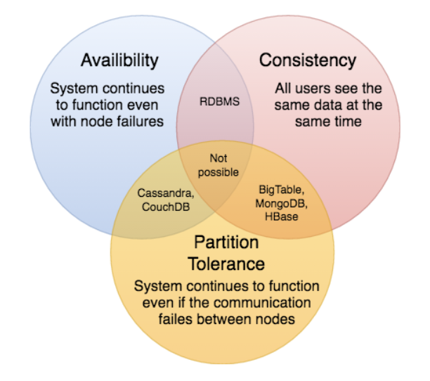

CAP Theorem

# keypoints
[CAP Theorem](https://en.wikipedia.org/wiki/CAP_theorem)
====
- it is impossible for a distributed software system to simultaneously provide more than two out of three of the following guarantees (CAP)
- Consistency
    - All nodes see the same data at the same time
    - achieved by updating several nodes before further reads
    - every read receives the most recent write or an error
- Availability
    - every request receives a response on success/failure
    - achieved by replicating the data across different servers
- Partition tolerance
    - system continues to work despite message loss or partial failure
    - can sustain any amount of network failure
    - the system continues to operate despite an arbitrary number of messages being dropped (or delayed) by the network between nodes
- CAP theorem implies that in the presence of a network partition, one has to choose between consistency and availability
- CAP is frequently misunderstood as if one has to choose to abandon one of the three guarantees at all times. In fact, the choice is really between consistency and availability only when a network partition or failure happens; at all other times, no trade-off has to be made.
- [ACID](https://en.wikipedia.org/wiki/ACID) databases choose consistency over availability.
- [BASE](https://en.wikipedia.org/wiki/Eventual_consistency) systems choose availability over consistency.

# text
- CAP theorem states that it is impossible for a distributed software system to simultaneously provide more than two out of three of the following guarantees (CAP): Consistency, Availability, and Partition tolerance. When we design a distributed system, trading off among CAP is almost the first thing we want to consider. CAP theorem says while designing a distributed system we can pick only two of the following three options:
- Consistency
    - All nodes see the same data at the same time. Consistency is achieved by updating several nodes before allowing further reads.
- Availability
    - Every request gets a response on success/failure. Availability is achieved by replicating the data across different servers.
- Partition tolerance
    - The system continues to work despite message loss or partial failure. A system that is partition-tolerant can sustain any amount of network failure that doesn’t result in a failure of the entire network. Data is sufficiently replicated across combinations of nodes and networks to keep the system up through intermittent outages.

- We cannot build a general data store that is continually available, sequentially consistent, and tolerant to any partition failures. We can only build a system that has any two of these three properties. Because, to be consistent, all nodes should see the same set of updates in the same order. But if the network loses a partition, updates in one partition might not make it to the other partitions before a client reads from the out-of-date partition after having read from the up-to-date one. The only thing that can be done to cope with this possibility is to stop serving requests from the out-of-date partition, but then the service is no longer 100% available.

