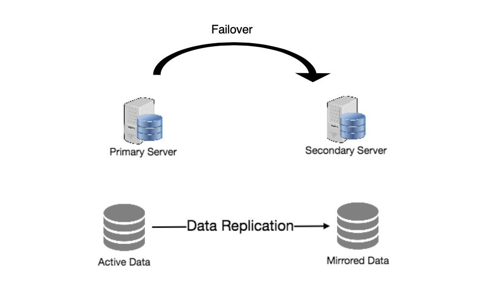

Redundancy & Replication
====
# keypoints
- Redundancy
    - **duplication of critical data or services** with the intention of increased reliability of the system.
    - remove single point of failure
    - if we have two servers and one fails, system can failover to the other one.
- primary-replica relationship
    - between the original and the copies. 
    - primary gets all updates
    - then ripple through to the replica servers
    - replca outputs message if received update successfully
- Shared-nothing architecture
  - Each node can operate independently of one another.
  - No central service managing state or orchestrating activities.
  - New servers can be added without special conditions or knowledge.
  - No single point of failure.

# text
- Redundancy is the duplication of critical components or functions of a system with the intention of increasing the reliability of the system, usually in the form of a backup or fail-safe, or to improve actual system performance. For example, if there is only one copy of a file stored on a single server, then losing that server means losing the file. Since losing data is seldom a good thing, we can create duplicate or redundant copies of the file to solve this problem.
- Redundancy plays a key role in removing the single points of failure in the system and provides backups if needed in a crisis. For example, if we have two instances of a service running in production and one fails, the system can failover to the other one.

- Replication means sharing information to ensure consistency between redundant resources, such as software or hardware components, to improve reliability, fault-tolerance, or accessibility.
- Replication is widely used in many database management systems (DBMS), usually with a primary-replica relationship between the original and the copies. The primary server gets all the updates, which then ripple through to the replica servers. Each replica outputs a message stating that it has received the update successfully, thus allowing the sending of subsequent updates.

