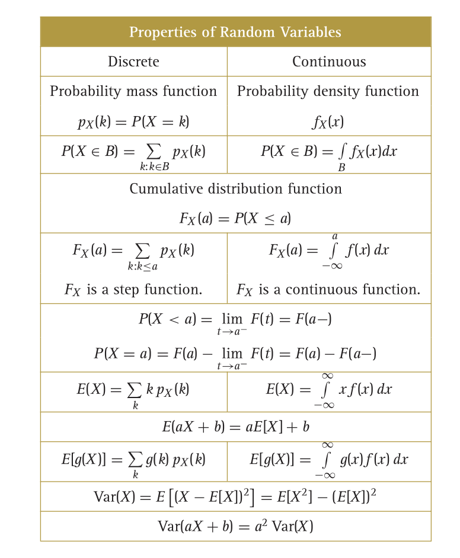

Introduction To Probability
====
<!--  -->

# Experiments with random outcomes
## Sample space & probabilities
- sample space \Omega
  - set of all the possible outcomes of the experiments
- sample points w
  - Elements of \Omega
- events
  - subset of \Omega
- \F
  - collection of events in \Omega
- probability measure / probability distribution P
  - func from \F to \R
  - P(A)
    - prob of event A
- Kolmogorov's axiom
  - 0 <= P(A) <= 1, \any A
  - P(\Omega) = 1, P(\empty) = 0
  - if A_1, A_2, A_3, ... pairwise disjoint events
    - P(\bigcup_{i=1}^{\inf} A_i) = \sum_{i=1}^{\infty} P(A_i)
    - P(A_1 \cup A_2 \cup ... \cup A_n) = P(A_1) + P(A_2) + ... + P(A_n)
- probability space (\Omega, \F, P)
- mutually exclusive
  - A_i \cap A_j = \empty
- cartesian product spaces
  - A_1 x A_2 x ... x A_n = {(x_1, x_2, ..., x_n) | x_i \in A_i, i \in [1,n]}
  - set of ordered n tuples with the i-th element from A_i

## random sampling
- sampling with & without replacement
- ordered & unordered sample

## consequence of the rules of probability
- P(A) + P(A^c) = 1
- monotonicity of probability
  - if A \subset B then P(A) <= P(B)
- inclusion - exclusion
  - P(A \cup B) = P(A) + P(B) - P(A \cap B)
  - P(A \cup B \cup C) = P(A) + P(B) + P(C) - P(A \cap B) - P(A \cap C) - P(B \cap C) + P(A \cap B \cap C)
- n person gets hat problem: n person have their hats mixed up, what is the probability that no one gets hi/her own hat? How does this probability bejave as n -> \inf
  - define event A_i = {personi gets his/her hat}
  - P(\bigcap_{i=1}^{n}A_i^c) = 1 - P(\bigcup_{i=1}^n A_i)
  - P(A_i1 \cap A_i2 \cap ... \cap A_ik) = P(i_1, ..., i_k gets their own hat) = \frac{(n-k)!}{n!}  (given k hats assigned correctly, number of ways (n-k) assigned to the rest of guests)
  - \sum_k P(A_i1 \cap A_i2 \cap ... \cap A_ik) = \binom{n}{k} \frac{(n-k)!}{n!} = \frac{1}{k!}
  - P(\bigcup_{i=1}^n A_i) = 1 - 1/2! + 1/3! + ... + (-1)^{n+1} 1/n!
  - P(\bigcap_{i=1}^{n}A_i^c) = 1/2! - 1/3! + ... + (-1)^n 1/n! = \sum_{k=0}^n (-1)^k/k!
  - if n -> \inf, then P(\bigcap_{i=1}^{n}A_i^c) = e^{-1}

## random variables
- random variable X is a function from \Omega into the real numbers
- X is degenerate if P(X = b) = 1
- probability distribution of X is P{X \in B} for set B of real numbers
- X is a discrete random variable if there exists a finite or countably infinite set {k_1, k_2, ...} of real numbers such that sum_i P(X = k_i) = 1
- probability mass function p.m.f. of a discrete random variable is p_X = p(k) = Pr(X = k) for all possible k of X

# Conditional probability and independence
## conditional probability
- The conditional probability of A given B is P(A | B) = P(AB) / P(B)
- Multiplication rule for n events
  - P(A_1A_2...A_n) = P(A_1)P(A_2|A_1)P(A_3|A_1A_2)...P(A_n|A_1A_2...A_{n-1})
- a finite collection of events {B_1, ..., B_n} is a partition of \Omega if B_iB_j = \empty whenever i != j and \bigcup_{i=1}^n B_i = \Omega

## bayes' formula
- P(B | A) = P(AB) / P(A) = \frac{P(A|B)P(B)}{P(A|B)P(B) + P(A|B^c)P(B^c)}
- general version of bayes' formula
  - P(B_k|A) = P(AB_k)/P(A) = \frac{P(A|B_k)P(B_k)}{\sum_{i=1}^n P(A|B_i)P(B_i)}

## independence
- A independent of B if P(A|B) = P(A) or P(AB) = P(A)P(B)
- if A B independent, same is true for A^c and B^c, A^c and B, A and B^c
- X_1, ..., X_n are random variables on the same probability space, then they are independent if P(X_1 \in B_1, X_2 \in B_2, ..., X_n \in B_n) = \prod_{k=1}^n P(X_k \in B_k)

## independent trials
- **Bernoulli distribution**
  - records the result of a single trial with 2 possile outcomes
  - 0 <= p < 1, X ~ Ber(p) with success probability p if X \in {0, 1} and P(X = 1) = p and P(X = 0) = 1-p
  - e.g. a sequence of n independent trials
    - Pr(X_1 = 0, X_2 = 1, X_3 = X_4 = 0) = p(1-p)^3
  - E[X] = p
  - Var(X) = p(1-p)
- **Binomial distribution**
  - X \sim Bin(n, p)
  - Let X be the number of successes in n indep trials, with success probaility p, X_i denotes the outcome of trial i
  - X = X_1 + X_2 + ... + X_n
  - Pr(X = k) = \binom{n}{k} p^k (1-p)^{n-k}
  - E[X] = np
  - Var(X) = np(1-p)
- **geometric distribution**
  - X \sim Geom(p)
  - infinite sequence of indep trials
  - X is the number of trials needed to see the first success
  - P(X = k) = P(X_1 = 0, X_2 = 0, ..., X_{k-1} = 0, X_k = 1) = (1-p)^{k-1}p
  - E[X] = 1/p
  - Var(X) = (1-p)/p^2
## Further topics
- conditional independence 
  - P(A_i1 A_i2 ... A_ik | B) = P(A_i1 | B) P(A_i2 | B) ... P(A_ik | B)
  - e.g. Suppose 9/10 coins are fair, 1/10 coins are biased with tail probability 3/5
    - A_1 = first flip yields tail, A_2 = second flip yields tail
    - success flipis of **a given coin** are independent
    - P(A_1|F) = P(A_2|F) = 1/2, P(A_1|B) = P(A_2|B) = 3/5
    - P(A_1A_2|F) = P(A_1|F)P(A_2|F), P(A_1A_2|B) = P(A_1|B)P(A_2|B) 
    - P(A_1A_2) = P(A_1A_2|F)P(F) + P(A_1A_2|B)P(B) 
- hypergeometric distribution
  - X \sim Hypergeom(N, N_A, n)
  - The result of each draw (the elements of the population being sampled) can be classified into one of two mutually exclusive categories
  - The probability of a success changes on each draw, as each draw decreases the population
  - X takes values in the set [0, n] 
  - k is num of successes/type A
  - P(X = k) = \frac{\binom{N_A}{k} \binom{N - N_A}{n-k}}{\binom{N}{k}}
  - sample n items without replacement, choose k items from N_A type A items, and n-k from N-N_A type B items
- the birthday problem
  - How large should a randomly selected group of people be to guarantee that with probability at least 1/2 there are two people with the same birthday?
  - Take a random sample size of k
  - p_k = Pr(there is repetition in the sample, how large should k be to have p_k > 1/2
  - A_k = the first k picks are all distinct
  - p(A_k) = \frac{365 * 364 * ... * (365 - (k-1))}{365^k}
  - p_k = 1 - p(A_k)

# random variables
## probability distribution of random variables
- discrete: Bernoulli, binomial, geometric
- probability density function p.d.f
  - P(X <= b) = \int_{-\inf}^{b} f(x) dx
- if a random variable X has density function f then point values have probability zero
  - P(X = c) = \int_c^c f(x) dx = 0 \any c
- f(x) \geq 0 for \any x \in \R
- \int_{-\inf}^{\inf} f(x) dx = 1
- **uniform distribution**
  - X \sim Unif[a, b]
  - f(x) = 1/(b-a) if x \in [a,b]
            0      otherwise
  - P(c <= X <= d) = \int_c^d 1/(b-a) dx
- the value f(x) of a density function is not a probability, but it gives probability of sets by integration
- P(a < X < a + \epsilon) \simeq f(a) * \epsilon
- E[X] = (a+b)/2
- Var(X) = (b-a)^2/12
## cumulative distribution function c.d.f
- F(s) = P(X <= s) \any s \in \R
- P(a < X <= b) = P(X <= b) - P(X <= a) = F(b) - F(a)
- For discrete random variable
  - F(s) = P(X <= s) = \sum_{k:k <= s} P(X = k)
- For continuous random variabnle
  - F(s) = P(X <= s) = \int_{-\inf}^s f(x) dx
- find pmf/pdf from cdf
  - if F is piecewise constant, then X is discrete. Possible values of X are where F has jumps. P(X = x) = magnitude of the jump of F at a
  - if F continuous, F'(x) exists everywhere, except possibly at finitely many points, then X is continuous, f(x) = F'(x). If F not differentiable at x, then f(x) can be set arbitrary
- property of cdf
  - monotonicity: if s < t then F(s) <= F(t)
  - right continuity: for each t \in \R, F(t) = lim_{s -> t^+} F(s)
  - lim_{t -> -\inf} F(t) = 0, lim_{t -> \inf} F(t) = 1
- P(X < a) = lim_{s -> a^-} F(s)

## Expectation
- expectation / first moment of discrete variablne: u = E[X] = \sum_{k} kP(X = k)
- expectation of continuous random variable : E[X] = \int_{-\inf}^{\inf} xf(x) dx
- St. Petersburg paradox: flip a coin, if head, win 2 dollars and game is over; if tail, prize is doubled and flip again. 
  - Let Y denote the prize
  - P(Y = 2^n) = 2^{-n}
  - E[Y] = \sum_{n=1}^{\inf} 2^n 2^{-n} = \sum 1 = \inf
- undefined expectation
  - you and I flip a fair coin until we see the first head
  - let n denote the number of flips needed, if n odd, you pay me 2^nl otherwise I pay you 2^n
  - P(X = 2^n) = 2^{-n}, for odd n>= 1
  - P(X = -2^n) = 2^{-n} for even n >= 1
  - E[X] = 2^1 * 2*{-1} + (-2^2) * 2*{-2} + ... = 1 - 1 + 1 - 1..
  - the expectation does not exist
- expectation of a function of random variable
  - discrete: E[g(X)] = \sum_k g(k) P(X = k)
  - continuous: E[g(X)] = \int_{-\inf}^{\inf} g(k) P(X = k)
- a stick of length l is broekn at a uniformly chosen random location. What is the expected length of the longer piece?
  - g(x) = l-x if 0 <= l-x <=l/2
            x if l/2 < x <= l
  - E[g(x)] = \int_0^l g(x) f(x) dx
            = \int_0^{l/2} (l-x)/l dx + \int_{l/2
             ^{l} x/l dx
            = 3l/4 
- the n-th moment of X is E[X^n] = \sum_k k^n P(X = k)
- median / 0.5-th quantile of X is any m that satisfies P(X >= m) >= 1/2, P(X <= m) >= 1/2
- first quartile: p = 0.25, third quartile: p = 0.75
- p-th quantile is any x satisfying P(X <= X) >= P, P(X >= x) >= 1-p

## variance
- Var(X) = E[(X - u)^2] = \sigma^2
        = E[X^2] - (E[X])^2
- standard deviation SD(X) = \sigma 
- discrete: Var(X) = \sum_k (k-u)^2 P(X = k)
- continuous Var(X) = \int_{\int}^{\int} (x-u)^2 f(x)dx
- for an indicator random variable, Var[I_A] = P(A) P(A^c)
- E(aX+b) = aE[X] + b
- Var(aX+b) = a^2Var(X)

## Gaussian distribution
- Z \sim N(0, 1), a random variable Z has standard normal distribution / standard Gaussian distribution if Z has density function \phi(x) = 1/\sqrt(2\pi) e^{-x^2/2}
- bell shaped curve
- c.d.f \Phi(x) = 1/\sqrt(2\pi) \int_{-\inf}^{x} e^{-s^2/2} ds
- X \sim N(u, \sigma^2) iff. f(x) = 1/\sqrt(2\pi \sigma^2)e^{-(x-u)^2/2\sigma^2}
- if X \sim N(u, \sigma^2), Z = (X - u)/\sigma
- if 1 <= k < l are integers and E[X^l] finite

# Approximations of the binomial distribution
## normal approximation
- central limit theorem
  - e.g. pmf of Bin(n, p) distribution can be close to the bell curve of the normal distribution
- law of rare events
  - When p small, Bin(n, p) close to Poisson()
- CLT for binomial
  - S_n \sim Bin(n, p) should approximate the density function of X \sim N(np, np(1-p)) as n becomes large
  - let p be fixed, then lim_{n -> \inf} P(a <= (S_n - np)/\sqrt(np(1-p)) <= b) = \int_a^b 1/\sqrt(2\pi) e^{-x^2/2} dx
- Suppose S_n \sim Bin(n, p) with n large and p not too close to 0 or 1, or np(1-p) > 10, then P(a <= (S_n - np)/\sqrt(np(1-p)) <= b) is close to \Phi(b) - \Phi(a)
- first approximated the binomial with the normal distribution, then approximated the c.d.f of normal distribution using the table in the appendix
- three sigma rule: \Phi(3) - \Phi(-3) \simeq 0.9974
- continuity correction
  - compared to P(k_1 <= S_n <= k_2),  P(k_1 -1/2 <= S_n <= k_2 + 1/2) is a better approximation

## law of large numbers
- law of large numbers for binomial random variables
  - \any fixed \epsilon > 0, lim_{n -> \inf} P(|S_n/n - p| < \epsilon) = 1
- CLT describes the error in the law of large numbers
  - S_n / n = p + \sigma/\sqrt(n) * (S_n - np)/(\sigma\sqrt(n)) \simeq p + \sigma/\sqrt(n) Z
  - decomposes S_n/n into a sum of p and a random error
  - for large n this random error is approximately normal w/ sdv \sigma/\sqrt(n)

## applications of the normal approximation
- want to estimate p for a biased coin
  - law of large number: flip n times, count S_n, take \hat(p) = S_n/n as the estimate for p
  - P(|\hat(p) - p| < \epsilon) = P(|S_n/n-p|<\epsilon)
                                = P(-ne < S_n - np < ne)
                                = then divide both sides by \sqrt(np(1-p))
                                = 2\Phi(e\sqrt(n)/\sqrt(p(1-p))) - 1
                                >= 2\Phi(2e\sqrt(n)) - 1
  - use it to solve problem that says 'how many times shold we flip a coin... so \hat(p) is within 0.05 of the true p, with probability at least 0.99?'
- confidence intervals
  - (\hat(p) - e, \hat(p) + e) contains the true p with probability at least r, 100r% is the confidence level
  - e.g. 'find the 95% confidence level'
    - use 2\Phi(2e\sqrt(n)) - 1 > 0.95 to solve for e
- maximum likelihood estimator
  - \hat(p) = S_n / n
  - once S_n = k has been observed, can use pmf of S_n to compare how likely outcome k is under different value of p
- polling
  - actually sampling without replacement - hypergeometric
  - but sampling with replacement leads to indep trials and binomal distribution for number of success
  - if sample size n small compared to population, then even if sampling w/ replcament, meeting the same person twice has low chance
  - could use Bin(n,p) for polling
  - Hypergeom(N, N_A, n) converges to Bin(n, p) as N -> \inf and N_A/N -> p
- random walk
  - let X_1, X_2, X_3 be indep random variable s.t. P(X_j = 1) = p, P(X_j = -1) = 1-p
  - S_0 = 0
  - S_n = X_1 + X_2 + .. + X_n
  - X_j is the j-th step, S_n is her position after n steps
  - random sequence S_0, S_1, S_2, ... is a simple random walk
  - if p = 1/2, then S_n is a symmetric simple random walk, otherwise asymmetric
  - T_n = number of times the coin came up heads