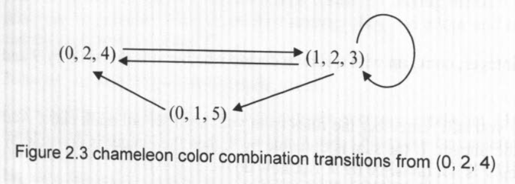

# Chapter 2 Brain Teasers
- In this chapter, we cover problems that only require common sense, logic, reasoning, and basic—no more than high school level—math knowledge to solve. In a sense, they are real brain teasers as opposed to mathematical problems in disguise. Although these brain  teasers do not require specific math knowledge, they are no less difficult than other quantitative interview problems. Some of these problems test your analytical and general problem-solving skills; some require you to think out of the box; while others ask you to solve the problems using fundamental math techniques in a creative way. In this chapter, we review sonic interview problems to explain the general themes of brain teasers that you are likely to encounter in quantitative interviews.

## 2.1 Problem Simplification
- If the original problem is so complex that you cannot come up with an immediate solution, try to identify a simplified version of the problem and start with it. Usually you can start with the simplest sub-problem and gradually increase the complexity. You do not need to have a defined plan at the beginning. Just try to solve the simplest cases and analyze your reasoning. More often than not, you will find a pattern that will guide you through the whole problem.

### **Screwy pirates**
- Five pirates looted a chest full of 100 gold coins. Being a bunch of democratic pirates, they agree cm the following method to divide the loot:
- The most senior pirate will propose a distribution of the coins. All pirates, including the mosr senior pirate, will then vote. If at least 50% of the pirates (3 pirates in this case) accept the proposal, the gold is divided as proposed. If not, the most senior pirate will be fed to shark and the process starts over with the next most senior pirate... The process is repeated until a plan is approved. You can assume that all pirates arc perfectly rational: they want to stay alive first and to get as much gold as possible second. Finally, being blood-thirsty pirates. they want to have fewer pirates on the boat if given a choice between otherwise equal outcomes.
- How will the gold coins be divided in the end?

- **Solution** 
    - If you have not studied game theory or dynamic programming, this strategy problem may appear to be daunting. If the problem with 5 pirates seems complex, we can always ,vtari with a simplified version of the problem by reducing the number of pirates. Since the solution to 1-pirate case is trivial, let's start with 2 pirates. The senior pirate (labeled as 2) can claim all the gold since he will always get 50% of the votes from himself and pirate 1 is left with nothing.
    - Let's add a more senior pirate, 3. He knows that if his plan is voted down, pirate 1 will get nothing. But if he offers private 1 nothing. pirate 1 will be happy to kill him. So pirate 3 will offer private 1 one coin and keep the remaining 99 coins, in which strategy the plan will have 2 votes from pirate 1 and 3.
    - If pirate 4 is added, he knows that if his plan is voted down, pirate 2 will get nothing. So pirate 2 will settle for one coin if pirate 4 offers one, So pirate 4 should offer pirate 2 one coin and keep the remaining 99 coins and his plan will be approved with 50% of the votes from pirate 2 and 4.
    - Now we finally come to the 5-pirate case. He knows that if his plan is voted down, both pirate 3 and pirate 1 will get nothing. So he only needs to offer pirate 1 and pirate 3 one coin each to get their votes and keep the remaining 98 coins. If he divides the coins this way. he will have three out of the five votes: from pirates 1 and 3 as well as himself.
    - Once we start with a simplified version and add complexity to it, the answer becomes obvious. Actually after the case n = 5, a clear pattern has emerged and we do not need to stop at 5 pirates. For any 2n+1 pirate case (n should be less than 99 though), the most senior pirate will offer pirates 1. 3, and 2n-1 each one coin and keep the rest for himself.

### **Tiger and sheep**
- One hundred tigers and one sheep are put on a magic island that only has
grass. Tigers can eat grass, but they would rather eat sheep. Assume: 
    - A. Each time only one tiger can eat one sheep, and that tiger itself will become a sheep after it eats the sheep. 
    - B. All tigers are smart and perfectly rational and they want to survive. So will the sheep be eaten?

- **Solution**
    - 100 is a large number. so again let's start with a simplified version of the problem. If there is only 1 tiger (n=1), surely it will eat the sheep since it does not need to worry about being eaten. How about 2 tigers? Since both tigers are perfectly rational, either tiger probably would do some thinking as to what will happen if it eats the sheep. Either tiger is probably thinking: if I eat the sheep, I will become a sheep, and then I will be eaten by the other tiger. So to guarantee the highest likelihood of survival, neither tiger will eat the sheep.
    - If there are 3 tigers, the sheep will be eaten since each tiger will realize that once it changes to a sheep, there will be 2 tigers left and it will not be eaten. So the first tiger that thinks this through will eat the sheep. If there are 4 tigers, each tiger will understand that if it eats the sheep, it will turn to a sheep. Since there are 3 other tigers, it will be eaten. So to guarantee the highest likelihood of survival, no tiger will eat the sheep.
    - Following the same logic, we can naturally show that if the number of tigers is even, the sheep will not be eaten. If the number is odd, the sheep will be eaten. For the case n = 100, the sheep will not be eaten.

## 2.2 Logic Reasoning
### **River crossing**
- Four people, A, B. C and D need to get across a river. The only way to cross the river is by an old bridge, which holds at most 2 people at a time. Being dark, they can't cross the bridge without a torch, of which they only have one. So each pair can only walk at the speed of the slower person. They need to get all of them across to the other side as quickly as possible, A is the slowest and takes 10 minutes to cross; B takes 5 minutes; C takes 2 minutes; and D takes 1 minute.
- What is the minimum time to get all of them across to the other side?
- **Solution**
    - The key point is to realize that the 10-minute person and this should not go with the 5-min person and this shoudl not happen in the first crossing, otherwise one of them has to go back, So C and D should go across first (2 min); then send D back (1 min)l A and B go across (10 min); send C back (2 min); C and D go across again (2 min)
    - It takes 17 minutes in total. Alternatively, we the second round, which takes 17 minutes as well.

### **Birthday problem*
- You and your colleagues know that your boss A's birthday is one of the following 10 dates:
    - Mar 4, Mar 5, Mar 8
    - Jun 4, Jun 7
    - Sep 1, Sep 5
    - Dec 1, Dec 2, Dec 8
- A told you only the month of his birthday. and told your colleague C only the day. After that, you first said: "I don't know A's birthday; C doesn't know it either." After hearing what you said, C replied: "I didn't know A's birthday, but now I know it." You smiled and said: "Now I know it, too." After looking at the 10 dates and hearing your comments, your administrative assistant wrote down A's birthday without asking any questions. So what did the assistant write?
- **Solution**
    - Don't let the "he said, she said" part confuses you. Just interpret the logic behind each individual's comments and try your best to derive useful information from these comments.
    - Let D be the day of the month of A's birthday, we have D \in {1,2,4,5,7,8}. If the birthday is on a unique day, C will know the A's birthday immediately. Among possible Ds, 2 and 7 are unique days. Considering that you are sure that C does not know A's birthday, you must infer that the day the C was told of is not 2 or 7. Conclusion: the month is not June or December. (If the month had been June, the day C was told of may have been 2; if the month had been December, the day C was told of may have been 7.)
    - Now C knows that the month must be either March or September. He immediately figures out A's birthday, which means the day must be unique in the March and September list. It means A's birthday cannot be Mar 5, or Sep 5. Conclusion: the birthday must be Mar 4, Mar 8 or Sep 1.
    - Among these three possibilities left, Mar 4 and Mar 8 have the same month. So if the month you have is March, you still cannot figure out A's birthday. Since you can figure out A's birthday, A's birthday must be Sep 1. Hence, the assistant must have written Sep 1.

### **Card game**
- A casino offers a card game using a normal deck of 52 cards. The rule is that you turn, over two cards each time. For each pair, if both are black, they go to the dealer's pile; If both are red, they go to your pile; if one black and one red, they are discarded. The process is repeated until you two go through all 52 cards. If you have more cards in your pile. you win $100; otherwise (including ties) you get nothing. The casino allows you to negotiate the price you want to pay for the game. How much would you be willing to pay to play this game?
- Hint: try to approach the problem using symmetty. Each discarded pair has one black and one red card. What does that tell you as to the number of black and red cards in the rest two piles?
- **Solution**
    - This surely is an insidious casino. No matter how the cards are arranged, you and the dealer will always have the same number of cards in your piles. Why? Because each pair of discarded cards have one black card and one red card, so equal number of red and black cards are discarded. As a result, the number of red cards left for you and the number of black cards left for the dealer are always the same. The dealer always wins! So we should not pay anything to play the game.

### **Burning ropes**
- You have two ropes, each of which takes 1 hour to burn. But either rope has different densities at different points, so there's no guarantee of consistency in the time it takes different sections within the rope to bum. How do you use these two ropes to measure 45 minutes?
- **Solution**
    - This is a classic brain teaser question. For a rope that takes x minutes to burn, if you light both ends of the rope simultaneously, it takes x12 minutes to burn. So we should light both ends of the first rope and light one end of the second rope. 30 minutes later, the first rope will get completely burned, while that second rope now becomes a 30-min rope. At that moment, we can light the second rope at the other end (with the first end still burning), and when it is burned out, the total time is exactly 45 minutes.

### **Defective ball**
- You have 12 identical balls. One of the balls is heavier OR lighter than the rest (you don't know which). Using just a balance that can only show you which side of the tray is heavier, how can you determine which ball is the defective one with 3 measurements?
- Hint: First do it for 9 identical balls and use only 2 measurements. knowing that one is heavier than the rest.
- **Solution**
    - This weighing problem is another classic brain teaser and is still being asked by many interviewers. The total number of balls often ranges from 8 to more than 100. Here we use n=12 to show the fundamental approach. The key is to separate the original group (as well as any intermediate subgroups) into three sets instead of two. The reason is that the comparison of the first two groups always gives inkirnat on about the third group.
    - Considering that the solution is wordy to explain, I draw a tree diagram in Figure 2.1 to show the approach in detail. Label the halls 1 through 12 and separate them to three groups with 4 balls each. Weigh balls 1, 2, 3, 4 against balls 5, 6, 7, 8. Then we go on to explore two possible scenarios: two groups balance, as expressed using an "=" sign, or 1, 2, 3, 4 are lighter than 5, 6, 7, 8, as expressed using an "<" sign. There is no need to explain the scenario that 1, 2, 3, 4 are heavier than 5, 6, 7, 8. (Why?)
    - If the two groups balance, this immediately tells us that the defective ball is in 9, 10, 11 and 12, and it is either lighter (L) or heavier (H) than other balls. Then we take 9, 10 and 11 from group 3 and compare balls 9, 10 with 8, 11. Here we have already figured out that 8 is a normal ball. If 9, 10 are lighter, it must mean either 9 or 10 is L or 11 is H. In which case, we just compare 9 with 10. If 9 is lighter, 9 is the defective one and it is L; if 9 and 10 balance, then 11 must he defective and H; If 9 is heavier, 10 is the defective one and it is L. If 9, 10 and 8, 11 balance, 12 is the defective one. If 9, 10 is heavier, than either 9 or 10 is if, or 11 is L.
    - You can easily follow the tree in Figure 2.1 for further analysis and it is clear from the tree that all possible scenarios can he resolved in 3 measurements.
    - 
    - In general if you have the information as to whether the defective ball is heavier or lighter, you can identify the defective ball among up to 3 balls using no more than n measurements since each weighing reduces the problem size by 2/3. If you have no information as to whether defective ball is heavier or ligter, you can identify the defective ball among up to (3^n - 3)/2 balls using no more than n measurements.

### **Trailing zeros**
- How many trailing zeros are there in 100! (factorial of 100)?
- **Solution**
    - This is an easy problem. We know that each pair of 2 and 5 will give a trailing zero. If we perform prime number decomposition on all the numbers in 100!, it is obvious that the frequency of 2 will far outnumber of the frequency of 5. So the frequency of 5 determines the number of trailing zeros. Among numbers 1, 2, ...,99, and 100, 20 numbers are divisible by 5 (5, 10, ..., 100 ). Among these 20 numbers, 4 are divisible by 5^2 (25, 50, 75, 100). So the total frequency of 5 is 24 and there are 24 trailing zeros.

### **Horse race**
- There are 25 horses, each of which runs at a constant speed that is different from the other horses'. Since the track only has 5 lanes, each race can have at most 5 horses. If you need to find the 3 fastest horses, what is the minimum number of races needed to identify them?
- **Solution**
    - This problem tests your basic analytical skills. To find the 3 fastest horses, surely all horses need to he tested. So a natural first step is to divide the horses to 5 groups (with horses 1-5, 6-10, 11-15, 16-20, 21-25 in each group). After 5 races, we will have the order within each group, let's assume the order follows the order of numbers (e.g., 6 is the fastest and 10 is the slowest in the 6-10 group). Such an assumption does not affect the generality of the solution. If the order is not as described, just change the labels of the horses. That means 1. 6, 11, 16 and 21 arc the fastest within each group.
    - Surely the last two horses within each group are eliminated. What else can we infer? We know that within each group, if the fastest horse ranks 5th or 4th among 25 horses, then all horses in that group cannot he in top 3; if it ranks the 3rd, no other horse in that group can be in the top 3; if it ranks the 2nd, then one other horse in that group may be in top 3; if it ranks the first, then two other horses in that group may be in top 3.
    - So let's race horses 1, 6, 11, 16 and 21. Again without loss of generality, let's assume the order is 1, 6, 11, 16 and 21. Then we immediately know that horses 4-5, 8-10, 12-15, 16-20 and 21-25 are eliminated. Since 1 is fastest among all the horses, 1 is in. We need to determine which two among horses 2, 3, 6, 7 and 11 are in top 3, which only takes one extra race.
    - So all together we need 7 races (in 3 rounds) to identify the 3 fastest horses.

### **Infinite sequence**
- If x^x^x^x^x ... = 2, where x^y = x to the power of y. What is x?
- **Solution**
    - This problem appears to be difficult, but a simple analysis will give an elegant solution. What do we have from the original equation
    - lim_{n -> \infty} x^x^x^ ... (n terms) = 2 <==> lim_{n -> \infty} x^x^x^ ... (n-1 terms) = 2. In other words, as n -> \infty, adding or minus one x^ should yield the same result
    - so x^x^x^x^x ... = x^(x^x^x^x^x ...) = x^2 = 2
    - x = \sqrt{2}

## 2.3 Thinking Out of the Box
### **Box packing**
- Can you pack 53 bricks of dimensions l x 1 x 4 into a 6x 6 x 6 box?
- **Solution**
    - This is a nice problem extended from a popular chess board problem. In that problem, you have a 8x 8 chess board with two small squares at the opposite. diagonal corners removed. You have many bricks with dimension 1 x 2, Can you pack 31 bricks into the remaining 62 squares? (An alternative question is whether you can cover all 62 squares using bricks without any bricks overlapping with each other or sticking out of the board, which requires a similar analysis.)
    - A real chess board figure surely helps the visualization. As shown in Figure 2.2, when a chess board is filled with alternative black and white squares, both squares at the opposite diagonal corners have the same color. If you put a 1 x 2 brick on the board, it will always cover one black square and one white square. Let's say it's the two black corner squares were removed, then the rest of the board can fit at most 30 bricks since we only have 30 black squares left (and each brick requires one black square). So to pack 31 bricks is out of the question. To cover all 62 squares without overlapping or overreaching, we must have exactly 31 bricks. Yet we have proved that 31 bricks cannot fit in the 62 squares left, so you cannot find a way to fill in all 62 squares without overlapping or overreaching.
    - 
    - Just as any good trading stratey, if more and more people get to know it and replicate it, the effectiveness of such a strategy will disappear. As the chess board problem becomes popular, many interviewees simply commit it to memory (after all, it's easy to remember the answer). So some ingenious interviewer came up with the newer version to test your thinking process, or at least your ability to extend your knowledge to new problems.
    - If we look at the total volume in this 3D problem, 53 bricks have a volume of 212, which is smaller then the box's volume 216. Yet we can show it is impossible to pack all the bricks into the box using a similar approach as the chess board problem. Let's imagine that the 6x 6 x 6 box is actually comprised of small 2 x 2 x 2 cubes. There should be 27 small cubes. Similar to the chess board (but in 3D), imagine that we have black cubes and white cubes alternates--it does take a little 3D visualization. So we have either 14 black cubes & 13 white cubes or 13 black cubes & 14 white cubes. For any 1x1x4 brick that we Rack into the box, half (1x1x2) of it must be in a black 2 x 2 x 2 cube and the other half must be in a white 2 x 2 x 2 cube. The problem is that each 2 x 2 x 2 cube can only be used by 4 of the 1 x 1 x 4 bricks. So for the color with 13 cubes, be it black or white, we can only use them for 52 1 x 1 x 4 tubes. There is no way to place the 53th brick. So we cannot pack 53 bricks of dimensions 1 x 1 x 4 into a 6 x 6 x 6 box.

### **Calendar cubes**
- You just had two dice custom-made. Instead of numbers 1-6, you place single-digit numbers on the faces of each dice so that every morning you can arrange the dice in a way as to make the two front faces show the current day of the month. You must use both dice (in other words, days 1-9 must be shown as 01 — 09), but you can switch the order of the dice if you want. What numbers do you have to put on the six faces of each of the two dice to achieve that?
- **Solution**
    - The days of a month include 11 and 22, so both dice must have 1 and 2. To express single-digit days, we need to have at least a 0 in one dice. Let's put a 0 in dice one first. Considering that we need to express all single digit days and dice two cannot have all the digits from 1 - 9, it's necessary to have a 0 in dice two as well in order to express all single-digit days.
    - So far we have assigned the following numbers:.
        - Dice one  1 2 0 ? ? ? 
        - Dice two 	1 2 0 ? ? ?
    - If we can assign all the rest of digits 3, 4, 5, 6, 7, 8, and 9 to the rest of the faces, the problem is solved. But there are 7 digits left. What can we do? Here's where you need to think out of the box. We can use a 6 as a 9 since they will never be needed at the same time! So, simply put 3, 4, and 5 ore one dice and 6, 7, and 8 on the other dice, and the final number on the two dice are
        - Dice one  1 2 0 3 4 5
        - Dice two 	1 2 0 6 7 8

### **Door to offer**
- You are facing two doors. One leads to your job offer and the other leads to exit. In front of either door is a guard. One guard always tells lies and the other always tells the truth. You can only ask one guard one yesIno question. Assuming you do want to get the job offer. what question will you ask?
- **Solution**
    - This is another classic brain teaser (maybe a little out-of-date in my opinion). One popular answer is to ask one guard: "Would the other guard say that you are guarding the door to the offer?" If he answers yes, choose the other door; if he answers no, choose the door this guard is standing in front of
    - There are two possible scenarios:
        - 1. Truth teller guards the door to offer: Liar guards the door to exit.
        - 2. Truth teller guards the door to exit; Liar guards the door to offer.
    - If we ask a guard a direct question such as "Are you guarding the door to the offer?" For scenario 1, both guards will answer yes; for scenario 2, both guards will answer no. So a direct question does not help us solve the problem. The key is to involve both guards in the questions as the popular answer does. For scenario 1, if we happen to choose the truth teller, he will answer no since the liar will say no; if we happen to choose the liar guard, he will answer yes since the truth teller will say no. For scenario 2, if we happen to choose the truth teller, he will answer yes since the liar will say yes; if we. happen to choose the liar guard, he will answer no since the truth teller with say yes. So for both scenarios, if the answer is no, we choose that door; if the answer is yes, we choose the other door. 
    
### **Message delivery**
- You need to communicate with your colleague in Greenwich via a messenger service. Your documents are sent in a padlock box. Unfortunately the messenger service is not secure, so anything inside an unlocked box will he lost (including any locks you place inside the box) during the delivery. The high-security padlocks you and your colleague each use have only one key which the person placing the lock owns. How can you securely send a document to your colleague?
- Hint: You can have more than one lock on the box.
- **Solution**
    - If you have a document to deliver, clearly you cannot deliver it in an unlocked box. So the first step is to deliver it to Greenwich in a locked box, Since you are the person who has the key to that lock, your colleague cannot open the box to get the document. Somehow you need to remove the lock before he can get the document, which means the box should be sent back to you before your colleague can get the document.
    - So what can he do before he sends back the box? He can place a second lock on the box, which he has the key to! Once the box is back to you, you remove your own lock and send the box back to your colleague. He opens his own lock and gets the document.

### **Last ball**
- A bag has 20 blue balls and 14 red balls. Each time you randomly take two balls out. (Assume each ball in the bag has equal probability of being taken). You do not put these two balls back. Instead, if both balls have the same color, you add a blue ball to the bag; if they have different colors, you add a red ball to the bag. Assume that you have an unlimited supply of blue and red balls, if you keep on repeating this process, what will be the color of the last ball left in the bag? What if the bag has 20 blue balls and 13 red balls instead?
- Hint: Consider the changes in the number of red and blue balls after each step.
- **Solution** 
    - Once you understand the hint, this problem should be an easy one. Let (B,R)
represent the number of blue balls and red balls in the bag. We can take a look what will happen after two balls are taken out.
    - Both balls are blue: (B, R) —> (B—1, R) 
    - Both balls are red: (B, R) -> (B+1, R—2) 
    - One red and one blue: (B, R) —> (B—1, R)
    - Notice that R either stays the same or decreases by 2, so the number of red balls will never become odd if we begin with 14 red balls. We also know that the total number of balls decreases by one each time until only one ball is left. Combining the information we have, the last ball must be a blue one. Similarly, when we start with odd number of red balls, the final ball must be a red one.

### **Light switches**
- There is a light bulb inside a room and four switches outside. All switches are currently at off state and only one switch controls the light bulb. You may turn any number of switches on or off any number of times you want. How many times do you need to go into the room to figure out which switch controls the light bulb?
- **Solution**
    - You may have seen the classical version of this problem with 3 light bulbs inside the room and 3 switches outside. Although this problem is slightly modified, the approach is exact the same. Whether the light is on and off is binary, which only allows us to distinguish two switches. If we have another binary factor, there are 2x 2 4 possible combinations of scenarios, so we can distinguish 4 switches. Besides light, a light bulb also emits heat and becomes hot after the bulb has been lit for some time, So we can use the on/off and cold/hot combination to decide which one of the four switches controls the light.
    - Turn on switches 1 and 2; move on to solve some other puzzles or do whatever you like for a while; turn off switch 2 and fin on switch 3; get into the room quickly, touch the bulb and observe \vhether the light is on or off.
    - The light bulb is on and hot -> switch t controls the light;
    - The light bulb is off and hot	-> switch 2 controls the light;
    - The light bulb is on and cold	-> switch 3 controls the light;
    - The light bulb is off and cold -> switch 4 controls the light, 

### **Quant salary**
- Eight quants from different banks are getting together for drinks. They are all interested in knowing the average salary of the group. Nevertheless, being cautious and humble individuals, everyone prefers not to disclose his or her own salary to the group. Can you come up with a strategy for the quants to calculate the average salary without knowing other people's salaries?
- **Solution**
    - This is a light-hearted problem and has more than one answer. One approach is for the first quant to choose a random number, adds it to his/her salary and gives it to the second quaint. The second quant will add his/her own salary to the result and give it to the third quant; ...; the eighth quant will add his/her own salary to the result and give it back to the first quant. Then the first quant will deduct the "random" number from the total and divide the "real" total by 8 to yield the average salary.
    - You may be wondering whether this strategy has any use except being a good brain teaser to test interviewees. It does have applications in practice. For example, a third party data provider collect fund holding position data (securities owned by a fund and the number of shares) from all participating firms and then distribute the information back to participants. Surely most participants do not want others to figure out what they are holding. If each position in the fund has the same fund ID every day, its easy to reverse-engineer the fund from the holdings and to replicate the strategy. So different random numbers (or more exactly pseudo-random numbers since the provider knows what number is added to the fund ID of each position and complicated algorithm is involved to make the mapping one to one) are added to the fund ID of each position in the funds before distribution. As a result, the positions in the same fund appear to have different fund IDs. That prevents participants from re-constructing other funds. Using this approach, the participants can share market information and remain anonymous at the same time.

## 2.4 Application of Symmetry
### **Coin piles**
- Suppose that you are blind-folded in a room and are told that there are 1000 coins on the floor. 980 of the coins have tails up and the other 20 coins have heads up. Can you separate the coins into two piles so to guarantee both piles have equal number of heads? Assume that you cannot tell a coin's side by touching it, but you are allowed to turn over any number of coins.
- **Solution**
    - Let's say that we separate the 1000 coins into two piles with ii coins in one pile and 1000— coins in the other. If there arc in coins in the first pile with heads up, there must be 20—m coins in the second pile with heads up. We also know that there are n—m coins in the first pile with tails up. We clearly cannot guarantee that m = 10 by simply adjusting n.
    - What other options do we have? We can turn over coins if we want to. Since we have no way of knowing what a coin's side is, it won't guarantee anything if we selectively flip coins. However, if we flip all the coins in the first pile, all heads become tails and all tails become heads. As a result, it will have n—m heads and m tails (symmetry). So, to start, we need to make the number of tails in the original first pile equal to the number of heads in the second pile; in other words, to make n-m = 20—n. n = 20 makes the equation hold. If we take 20 coins at random and turn them all over, the number of heads among these turned-over 20 coins should be the same as the number of heads among the other 980 coins.

### **Mislabeled bags**
- You are given three bags of fruits. One has apples in it; one has oranges in it; and one has a mix of apples and oranges in it. Each bag has a label on it (apple, orange or mix). Unfortunately, your manager tells you that	ALL bags are mislabeled. Develop a strategy to identify the bags by taking out minimum number of fruits? You can take any number of fruits from any bags.
- **Solution** 
    - The key here is to use the fact that ALL bags are mislabeled. For example, a bag labeled with apple must contain either oranges only or a mix of oranges and apples. Let's look at the labels: orange, apple, mix (orange + apple). Have you realized that the orange label and the apple label are symmetric? if not, let me explain it in detail: If you pick a fruit from the bag with the orange label and it's an apple (orange --> apple), then the bag is either all apples or a mix. If you pick a fruit from the bag with the apple label and it's an orange (apple orange), then the bag is either an orange bag or a mix. Symmetric labels are not exciting and are unlikely to be the correct approach. So let's try the bag with the mix label and get one fruit from it. If the fruit we get is an orange, then we know that bag is actually orange (It cannot be a mix of oranges and apples since we know the bag's label is wrong). Since the bag with the apple label cannot be apple only. it must he the znix bag. And the bag with the orange label must be the apple hag. Similarly, for the case that apples are in the bag with the mix label, we can figure out all the bags using one single pick.

### **Wise men**
- A sultan has captured 50 wise men. He has a glass currently standing bottom down. Every minute he calls one of the wise men who can choose either to turn it over (set it upside down or bottom down) or to do nothing. The wise men Fill be called randomly, possibly for an infinite number of times. When someone called to the sultan correctly states that all wise men have already been called to the sultan at least once, everyone goes free. But if his statement is wrong, the sultan puts everyone to death. The wise men are allowed to communicate only once before they get imprisoned into separate rooms (one per room). Design a strategy that lets the wise men go free.
- **Solution**
    - For the strategy to work, one wise man, let's call him the spokesman, will state that every one has been called. What does that tell us? 1. All the other 49 wise men are equivalent (symmetric). 2. The spokesman is different from the other 49 men. So naturally those 49 equivalent wise men should act in the same way and the spokesman should act differently.
    - Here is one of such strategies: Every one of the 49 (equivalent) wise men should flip the glass upside down the first time that he sees the glass bottom down. He does nothing if the glass is already upside down or he has flipped the glass once. The spokesman should flip the glass bottom down each time he sees the glass upside down and he should do nothing if the glass is already bottom down, After he does the 49th flip, which means all the other 49 wise men have been called, he can declare that all the wise men have been called.

## 2.5 Series Summation
### **Clock pieces**
- A clock (numbered 1 - 12 clockwise) fell off the wall and broke into three pieces. You find that the sums of the numbers on each piece are equal. What are the numbers on each piece? (No strange-shaped piece is allowed.)
- **Solution** 
    - Using the summation equation, \sum_{n=1}^{12} = \frac{12 * 13}{2} = 78. So the numbers on each piece must sum up to 26. Some interviewees mistakenly assume that the numbers on each piece have to be continuous because no strange-shaped piece is allowed. It's easy to see that 5. 6, 7 and 8 add up to 26. Then the interviewees' thinking gets stuck because they cannot find more consecutive numbers that add up to 26.
    - Such an assumption is not correct since 12 and 1 are continuous on a clock. Once that ‘‘rong assumption is removed, it becomes clear that 12+1=13 and 11+2 =13. So the second piece is 11, 12, 1 and 2; the third piece is 3, 4, 9 and 10.

### **Missing integers**
- Suppose we have 98 distinct integers from 1 to 100. What is a good way to find out the two missing integers (within [1, 100])?
- **Solution** 
    - Denote the missing integers as x and y, and the existing ones are z_1, ..., z_{98}. Applying the summation equations, we have
        - \sum_{n=1}{100} n = x + y + \sum_{i=1}^{98} z_i ==> x + y = 100 * 101 / 2 - \sum_{i=1}^{98} z_i
        - \sum_{n=1}{100} n^2 = x^2 + y^2 + \sum_{i=1}^{98} z_i^2 ==> x^2 + y^2 = 100^3 / 3 + 100^2 / 2 + 100 / 6 - \sum_{i=1}^{98} z_i^2
    - Using these two equations, we can easily solve x and y. If you implement this strategy using a computer program, it is apparent that the algorithm has a complexity of 0(n) for two missing integers in 1 to n

### **Counterfeit coins I**
- There are 10 bags with 100 identical coins in each bag. In all bags but one, each coin weighs 10 grams. However, all the coins in the counterfeit bag weigh either 9 or 11 grams. Can you find the counterfeit bag in only one weighing, using a digital scale that tells the exact weight?'
- Hint: In order to find the counterfeit coin bag in one weighing, the number of coins from each bag must be different. If we use the same number of coins from two bags, symmetry will prevent you from distinguish these two bags if one is the counterfeit coin bag.
- **Solution** 
    - Yes, we can identify the counterfeit bag using one measurement. Take 1 coin out of the first bag, 2 out of the second bag, 3 out the third bag, ..., and 10 coins out of the tenth bag. All together, there are \sum_{i=1}{10} n = 55 coins. If there were no counterfeit coins, they should weigh 550 grams. Let's assume the i-th bag is the counterfeit bag, there will be i counterfeit coins, so the final weight will be 550 ± i. Since i is distinct for each bag, we can identify the counterfeit coin bag as well as whether the counterfeit coins are lighter or heavier than the real coins using 550 ± i.
    - This is not the only answer: we can choose other numbers of coins from each bag as long as they are all different numbers.

### **Glass balls**
- You are holding two glass balls in a 100-story building. If a ball is thrown out of the window, it will not break if the floor number is less than X, and it will always break if the floor number is equal to or greater than X. You would like to determine X. What is the strategy that will minimize the number of drops for the worst case scenario? 
- Hint: Assume we design a strategy with N maximum throws. If the first ball is thrown once, the second ball can cover N-1 floors; if the first ball is thrown twice, the second ball can cover N - 2 floors...
- **Solution**
    - Suppose that we have a strategy with a maximum of N throws. For the first throw of bail one, we can try the N-th floor. If the ball breaks, we can start to try the second ball from the first floor and increase the floor number by one until the second ball breaks. At most, there are N–1 floors to test. So a maximum of N throws are enough to cover all possibilities. If the first ball thrown out of N-th floor does not break, we have N–1 throws left. This time we can only increase the floor number by N–1 for the first ball since the second ball can only cover N–2 floors if the first ball breaks. If the first ball thrown out of (2N-1)th floor does not break, we have N–2 throws left. So we can only increase the floor number by N–2 for the first ball since the second ball can only cover N–3 floors if the first ball breaks ..
    - Using such logic, we can see that the number of floors that these two balls can cover with a maximum of N throws is N + (N – 1) + ... + 1 = N(N+1)/2. In order to cover 100 stories, we need to have N(N+1)/2 >= 100, Taking the smallest integer, we have N = 14. 
    - Basically, we start the first ball on the 14th floor, if the ball breaks, we can use the second ball to try floors 1, 2, ..., 13 with a maximum throws of 14 (when the 13th or the 14th floor is X). If the first ball does riot break, we will try the first ball on the 14+(14–1) = 27th floor. If it breaks, we can use the second ball to cover floors 15, 16, ..., 26 with a total maximum throws of 14 as well...

## 2.6 The Pigeon Hole Principle
- Here is the basic version of the Pigeon Hole Principle: if you have fewer pigeon holes thanpigeons and you put every pigeon in a pigeon hole, then at least one pigeon hole has more than one pigeon. Basically it says that if you have 12 holes andmore than n+1 pigeons, at least 2 pigeons have to share one of the holes. The generalized version is that if you have n holes and at least mn +1 pigeons, at least m+1 pigeons have to share one of the holes. These simple and intuitive ideas are surprisingly useful in many problems. Here we will use some examples to show their applications.

### **Matching socks**
- Your drawer contains 2 red socks, 20 yellow socks and 31 blue socks. Being a busy and absent-minded MIT student, you just randomly grab a number of socks out of the draw and try to find a matching pair. Assume each sock has equal probability of being selected, what is the minimum number of socks you need to grab in order to guarantee a pair of socks of the same color?
- **Solution**
    - This question is just a variation of the even simpler version of two-color-socks problem, in which case you only need 3. When you have 3 colors (3 pigeon holes), by the Pigeon Hole Principle, you will need to have 3 + 1 = 4 socks (4 pigeons) to guarantee that at least two socks have the same color (2 pigeons share a hole).

### **Handshakes**
- You are invited to a welcome party with 25 fellow team members. Each of the fellow members shakes hands with you to welcome you. Since a number of people in the room haven't met each other, there's a lot of random handshaking among others as well. If you don't know the total number of handshakes, can you say with certainty that there are at least two people present who shook hands with exactly the same number of people?
- **Solution**
    - There are 26 people at the party and each shakes hands with from 1 —- since everyone shakes hands with you -- to 25 people. In other words, there are 26 pigeons and 25 holes. As a result, at least two people must have shaken hands with exactly the same number of people.

### **Have we met before?**
- Show me that, if there are 6 people at a party, then either at least 3 people met each other before the party, or at least 3 people were strangers before the party. 
- **Solution**
    - This question appears to be a complex one and interviewees often get puzzled by what the interviewer exactly wants. But once you start to analyze possible scenarios, the answer becomes obvious.
    - Let's say that you are the 6th person at the party. Then by generalized Pigeon Hole Principle (Do we even need that for such an intuitive conclusion?), among the remaining 5 people, we conclude that either at least 3 people met you or at least 3 people did not meet you. Now let's explore these two mutually exclusive and collectively exhaustive scenarios:
    - Case 1: Suppose that at least 3 people have met you before.
        - If two people in this group met each other, you and the pair (3 people) met each other. If no pair among these people met each other, then these people 3 people) did not meet each other. In either sub-case, the conclusion holds.
    - Case 2: Suppose at least 3 people have not met you before.
        - If two people in this group did not meet each other, you and the pair (3 people) did not meet each other. If all pairs among these people knew each other, then these people (3 people) met each other. Again, in either sub-case, the conclusion holds.

### **Ants on a square**
- There are 51 ants on a square with side length of 1. If you have a glass with a radius of 1/7, can you put your glass at a position on the square to guarantee that the glass encompasses at least 3 ants?
- Hint: Separate the square into 25 smaller areas; then at least one area has 3 ants in it.
- **Solution**
    - To guarantee that the glass encompasses at least 3 ants, we can separate the square into 25 smaller areas. Applying the generalized Pigeon Hole Principle, we can show that at least one of the areas must have at least 3 ants. So we only need to make sure that the glass is large enough to cover any of the 25 smaller areas. Simply separate the area into 5x5 smaller squares with side length of 1/5 each will do since a circle with radius of 1/7 can cover a square (A circle with radius r can cover a square with side length up to \sqrt{2}r) with side length 1/5.

### **Counterfeit coins**
- There are 5 bags with 100 coins in each bag. A coin can weigh 9 grams, 10 grams or 11 grams. Each bag contains coins of equal weight, but we do not know what type of coins a bag contains. You have a digital scale (the kind that tells the exact weight). How many times do you need to use the scale to determine which type of coin each bag contains?
- **Solution**
    - If the answer for 5 bags is not obvious, let's start with the simplest version of the problem -- 1 bag. We only need to take one coin to weigh it. Now we can move on to 2 bags. How many coins do we need to take from bag 2 in order to determine the coin types of bag 1 and bag 2? Considering that there are three possible types for bag 1, we will need three coins from bag 2; two coins won't do. For notation simplicity, let's change the number/weight for three types to -1, 0 and 1 (by removing the mean 10). If we only use 2 coins from bag 2, the final sum for 1 coin from bag 1 and 2 coins from bag 2 ranges from -3 to 3 (7 pigeon holes). At the same time we have 9 (3 x 3) possible combinations for the weights of coins in bag 1 and bag 2 (9 pigeons). So at least two combinations will yield the same final sum (9>7, so at least two pigeons need to share one hole), and we can not distinguish them. If we use 3 coins from bag 2, then the sum ranges from -4 to 4, which is possible to cover all 9 combinations. The following table exactly shows that all possible combinations yield different sums:
    - 
    - Then how about 3 bags? We are going to have 3^3 = 27 possible combinations. Surely an indicator ranging from –13 to 13 will cover it and we will need 9 coins from bag 3. The possible combinations are shown in the following table:
    - 
    - Following this logic, it is easy to see that we will need 27 coins from bag 4 and 81 coins from bag 5. So the answer is to take 1, 3, 9, 27 and 81 coins from bags 1, 2, 3, 4, and 5, respectively, to determine which type of coins each bag contains using a single weighing.

## 2.7 Modular Arithmetic
- The modulo operation —- denoted as x%y or x mod y -- finds the remainder of division of number x by another number y. For simpicility, we only consider the case where y is a positive integer. For example, 5%3 = 2. An intuitive property of modulo operation is that if x1 % y = x2 % y, then (x1 - x2) % y = 0. From this property we can also show that x%y, (x+1)%y, ..., and (x+y—1)%y are all different numbers.

### **Prisoner problem**
- One hundred prisoners are given the chance to be set free tomorrow. They are all told that each will be given a red or blue hat to wear. Each prisoner can see everyone else's hat but not his own. The hat colors are assigned randomly acid once the hats are placed on top of each prisoner's head they cannot communicate with one another in any form, or else they are immediately executed. The prisoners will be called out in random order and the prisoner called out will guess the color of his hat. Each prisoner declares the color of his hat so that everyone else can hear it. If a prisoner guesses correctly the color of his hat, he is set free immediately; otherwise he is executed.
- They are given the night to come up with a strategy among themselves to save as many prisoners as possible. What is the best strategy they can adopt and how many prisoners can they guarantee to save?
- Hint: The first prisoner can see the number of red and blue hats of all other 99 prisoners. One color has odd number of ocunts and the other 
- **Solution**
    - At least 99 prisoners can be saved.
    - The key lies in the first prisoner who can see everyone else's hat. He declares his hat to be red if the number of red hats he sees is odd. Otherwise he declares his hat to be blue. He will have a 1/2 chance of having guessed correctly. Everyone else is able to deduce his own hat color combining the knowledge whether the number of red hats is odd among 99 prisoners (excluding the first) and the color of the other 98 prisoners (excluding the first and himself). For example, if the number of red hats is odd among the other 99 prisoners. A prisoner wearing a red hat will see even number of red hats in the other 98 prisoners (excluding the first and himself) and deduce that he is wearing a red hat.
- The two-color case is easy, isn't it? What if there are 3 possible hat colors: red, blue, and white? What is the best strategy they can adopt and how many prisoners can they guarantee to save?
- Hint: That a number is odd simply means x%2 = 1. Here we have 3 colors, so you may want to consider x%3 instead
- **Solution**
    - The answer is still that at least 99 prisoners will be saved. The difference is that the first prisoner now only has 1/3 chance of survival. Let's use the following scoring system: red = 0, green = 1, and blue = 2. The first prisoner counts the total score for the rest of 99 prisoners and calculates s%3. If the remainder is 0, he announces red; if the remainder is 1, green; 2, blue. He has 1/3 chance of living, but all the rest of the prisoners can determine his own score (color) from the remainder. Let's consider a prisoner i among 99 prisoners (excluding the first prisoner). He can calculate the total score (x) of all other 98 prisoners. Since (x+O)%3, (x+1)%3, and (x+2)%3 are all different, so from the remainder that the first prisoner gives (for the 99 prisoners including i), he can determine his own score (color). For example, if prisoner i sees that there are 32 red, 29 green and 37 blue in those 98 prisoners (excluding the first and himself). The total score of those 98 prisoners is 103. If the first prisoner announces that the remainder is 2 (green), then prisoner i knows his own color is green (1) since only 104%3 = 2 among 103, 104 and 105.
    - Theoretically, a similar strategy can be extended to any number of colors. Surely that requires all prisoners to have exceptional memory and calculation capability.

### **Division by 9**
- Given an arbitrary integer, come up with a rule to decide whether it is divisible by 9 and prove it.
- **Solution**
    - Hopefully you still remember the rules from your high school math class. Add up all the digits of the integer. If the sum is divisible by 9, then the integer is divisible by 9; otherwise the integer is not divisible by 9. But how do we prove it?
    - Let's express the original integer as a = a_n 10^n + a_{n-1} 10^{n-1} + ... + a_1 10 + a_0. Basically we state that if a_n + a_{n-1} + ... + a_1 + a_0 = 9x (x is a integer), then the a is divisible by 9 as well. 
    - The proof is straightforward: For any aa = a_n 10^n + a_{n-1} 10^{n-1} + ... + a_1 10 + a_0, let b = a - (a_n + a_{n-1} + ... + a_1 + a_0). We have b = a_n(10^n —1) + a_{n-1(10^{n-1} — 1) + ... + a_1(10' — 1) = a — 9 x , which is divisible by 9 since all (10k^ — 1), k = 1, ... ,n are divisible by 9. Because both b and 9x are divisible by 9, a = b + 9x must be divisible by 9 as well.
    - (Similarly you can also show that a = (-1)^n a_n + (-1)^{n-1} a_{n-1} + ... + (-1)^1 a_1 + a_0 = 11x is the necessary and sufficient condition for a to be divisible by 11.)

### **Chameleon colors**
- A remote island has three types of chameleons with the following population: 13 red chameleons, 15 green chameleons and 17 blue chameleons. Each time two chameleons with different colors meet, they would change their color to the third color. For example, if a green chameleon meets a red chameleon, they both change their color to blue. Is it ever possible for all chameleons to become the same color? Why or why not?
- Hint: consider the numbers in modulo of 3
- **Solution**
    - It is not possible for all chameleons to become the same color,. There are several approaches to proving this conclusion. Here we discuss two of them. 
    - Approach 1. 
        - Since the numbers 13, 15 and 17 are "large" numbers, we can simplify the problem to 0, 2 and 4 for three colors, (To see this, you need to realize that if combination (m+1, n+1, p+1) can be converted to the same color, combination (m,n,p) can be converted to the same color as well.) Can a combination (0,2,4) be converted to a combination (0,0,6)? The answer is NO, as shown in Figure 2.3:
        - 
        - Actually combination (1,2,3) is equivalent to combination (0,1,2), which can only be converted to another (0,1, 2) but will never reach (0, 0,3).
    - Approach 2. 
        - A different, and more fundamental approach, is to realize that in order for all the chameleons to become the same color, at certain intermediate stage, two colors must have the same number. To see this just imagine the stage before a final stage. It must has the combination (1,1,x). For chameleons of two different colors to have the same number, their module of 3 must be the same as well. We start with 15 = 3x, 13 = 3y +1, and 17 = 3z + 2 chameleon, when two chameleons of different colors meet, we will have three possible scenarios:
        - (3x, 3y+1, 3z + 2) => 
            - (3x+2. 3y, 3z+1) = (3x', 3y'+1, 3z'+2), one y meets one z
            - (3(x-1) + 3, 3(y+1), 3z+1) = (3x', 3y'+1, 3z'+2), one x meets one z
            - (3(x-1)+2, 3y, 3(z+1)+1) = (3x', 3y'+1, 3z'+2), one x meets one y
        - So the pattern is preserved and we will never get two colors to have the same module of 3. In other words, we cannot make two colors have the same number. As a result, the chameleons cannot become the same color. Essentially, the relative change of any pair of colors after two chameleons meet is either 0 or 3. In order for all the chameleons to become one color, at least one pair's difference must be a multiple of 3.

## 2.8 Math Induction
- Induction is one of the most powerful and commonly-used proof techniques in mathematics, especially discrete mathematics. Many problems that involve integers can be solved using induction. The general steps for proof by induction are the following:
    - State that the proof uses induction and define an appropriate predicate P(n)
    - Prove the base case P(1) , or any other smallest number n for the predicate to be true.
    - Prove that P(n) implies P(n +1) for every integer n. Alternatively, in a strong induction argument, you prove that P(1), P(2), • • • , and P(n) together imply P(n +1) .
- In most cases, the real difficulty lies not in the induction step, but to formulate the problem as an induction problem and come up with the appropriate predicate P(n). The simplified version of the problem can often help you identify P(n). 

### **Coin split problem**
- You split 1000 coins into two piles and count the number of coins in each pile. If there are x coins in pile one and y coins in pile two, you multiple x by y to get xy. Then you split both piles further, repeat the same counting and multiplication process, and add the new multiplication results to the original. For example, you split x to x_1 and x_2, y to y_1 and y_2, then the sum is xy + x_1x_2 + y_1y_2 The same process is repeated until you only have piles of 1 stone each. What is the final sum? (The final 1's are not included in the sum.) Prove that you always get the same answer no matter how the piles are divided.
- **Solution**
    - Let n be the number of the coins and f(n) be the final sum. It is unlikely that a solution will jump to our mind since the number n = 1000 is a large number. If you aren't sure how to approach the problem, it never hurts to begin with the simplest cases and try to find a pattern. For this problem, the base case has n = 2. Clearly the only split is 1+1 and the final sum is 1. When n = 3, the first split is 2+1 and we have xy = 2 and the 2-coin pile will further give an extra multiplication result 1, so the final sum is 3. This analysis also gives the hint that when n coins are split into x and n — x coins, the total sum will be f(n) = x(n - x) + f(x) + f(n - x). 4 coins can be split into 2+2 or 3+1. For either case we can apply x(n — x) + f (x) + f (n x) and yields the same final sum 6.
    - Hint: f(2) = 1, f(3) - f(2) = 2, and f(4) - f(3) = 3 should give you enougj hint to realize the pattern is f(n) = 1 + 2 + ... + (n-1) = n(n-1)/2
    - Claim: For n coins, independent of intermediate splits, the final sum is n(n-1)/2
    - So how do we prove it? The anser should be clear to you: by strong induction. We have proved the claim for the base cases n = 2,3,4. Assume the claim is true for n = 2, ..., N-1 coins, we need to prove tgat it holds for n = N coins as well. Again we apply the equation f(n) = x(n-x) + f(x) + f(n-x). If N coins are split into x coins and N-x coins, we have 
        - f(N) = x(N-x) + f(x) + f(N-x) = x(N-x) + N(N-1)/2 + (N-x)(N-x-1)/2 = N(N-1)/2
    - So indeed it hodls for n = N as well and f(n) = n(n-1)/2 is true for any n >= 2. Applying the conclusion to n = 1000, we have f(n) = 1000 * 999/2

### **Chocolate bar problem**
A chocolate bar has 6 rows and 8 columns (48 small lx 1 squares). You break it into individual squares by making a number of breaks. Each time, break one rectangle two smaller rectangles. For example, in the first step you can break the 6 x 8 chocolate bar into a 6 x 3 one and a 6 x 5 one. What is the total number of breaks needed in order to break the chocolate bar into 48 small squares?
- **Solution**
    - Let m be the number of the rows of the chocolate bar and n be the number of columns. Since there is nothing special for the case m = 6 and n = 8, we should find a general solution for all m and n. Let's begin with the base case where m = 1 and n = 1. The number of breaks needed is clearly 0. For m > 1 and n = 1, the number of breaks is m — 1; similarly for m = 1 and n > 1, the number of breaks is n — 1. So for any In and n, if we break the chocolate into m rows first, which takes m — 1 breaks, and then break each row into n small pieces, which takes m(n —1) breaks, the total number of breaks is (m — 1) + m(n — 1) = mn — 1. If we breaks it into n columns first and then break each column into m small pieces, the total number of breaks is also mn — 1. But is the total number of breaks always mn — 1 for other sequences of breaks? Of course it is. We can prove it using strong induction.
    - We have shown the number of breaks is mn — 1 for base cases m >= 1, n = 1 and m = 1, n >= 1. To prove it for a general m x n case, let's assume the statement is true for cases where rows < m, columns <= n and rows <= m, columns <= n. If the first break is along a row and it is broken into two smaller pieces m x n_1 and m x (n - n_1), then the total number of breaks is 1+ (m x n_1 — 1) + (m x (n - n_1) — 1) = mn — 1. Here we use the results for rows < m, columns < n. Similarly, if it is broken into two pieces m_1 x n and (m - m_1) * n, the total number of breaks is 1 + (m_1 x n — 1) + ((m — m_1)x n — 1) = mn — 1. So the total number of breaks is always mn — 1 in order to break the chocolate bar into m x n small pieces. For the case m = 6 and n = 8, the number of breaks is 47.
    - Although induction is the standard approach used to solve this problem, there is actually a simpler solution if you've noticed an important fact: the number of pieces always increases by 1 with each break since it always breaks one piece into two. In the beginning, we have a single piece. In the end, we will have mn pieces. So the number of breaks must be mn —1.

### **Race track**
- Suppose that you are on a one-way circular race track. There are N gas cans randomly placed on different locations of the track and the total sum of the gas in these cans is enough for your car to run exactly one circle. Assume that your car has no gas in the gas tank initially, but you can put your car at any location on the track and you can pick up the gas cans along the way to fill in your gas tank. Can you always choose a starting position on the track so that your car can complete the entire circle?
- Hint: start with N = 1,2 and solve the problem using induction
- **Solution**
    - If you get stuck as to how to solve the problem, again start with the simplest cases (N = 1, 2) and consider using an induction approach. Without loss of generality, let's assume that the circle has circumference of 1. For N = 1, the problem is trivial. Just start at where the gas can is. For N = 2, The problem is still simple. Let's use a figure to visualize the approach. As shown in Figure 2.4A, the amount of gas in can 1 and can 2, expressed as the distance the car can travel, are x_1 and x_2 respectively, so x_1 + x_2 = 1. The corresponding segments are y_1 and y_2 so y_1 + y_2 = 1 . Since x_1 + x_2 = 1 and y_1 + y_2 = 1, we must have x_1 >= y_1 or x_2 >= y_2 (x_1 < y_1 and x_2 < y_2 cannot both be true). If x_1 >= y_1, we can start at gas can 1, which has enough gas to reach gas can 2, and get more gas from gas can 2 to finish the whole circle. Otherwise, we will just start at gas can 2 and pick up gas can I along the way to finish the whole circle.
    - 
    - The argument for N = 2 also gives us the hint for the induction step. Now we want to show that if the statement holds for N = n, then the same statement also holds for N = n+1. As shown in Figure 2.4B, we have x_1 + x_2 + ... + x_{n+1} = 1 and y_1 + y_2 + ... + y_{n+1} = 1 for N = n+1. So there must exist at least one i, 1 <= i <= n+1, that has x_i >= y_i. That means whenever the car reaches x_i, it can reach x_{i+1} with more gas (For i = n+1, it goes to i = 1 instead). In other words, we can actually "combine" x_i and x_{i+1} to one gas can at the position of x_i with an amount of gas x_i + x_{i+1} (and eliminate the gas can i+1). But such combination reduces the N = n+1 problem to N = n, for which the statement holds. So the statement also holds for N = n +1. Hence we can always choose a starting position on the track to complete the entire circle for any N.
    - There is also an alternative approach to this problem that provides a solution to the starting point. Let's imagine that you have another car with enough gas to finish the circle. You put that car at the position of a randomly chosen gas can and drive the car for a full circle. Whenever you reach a gas can (including at the initial position), you measure the amount of gas in your gas tank before you add the gas from the can to your gas tank. After you finish the circle, read through your measurement records and find the lowest measurement. The gas can position corresponding to the lowest measurement should be your starting position if the car has no gas initially. (It may take some thinking to fully understand this argument. I'd recommend that you again draw a figure and give this argument some careful thoughts if you don't find the reasoning obvious.)

