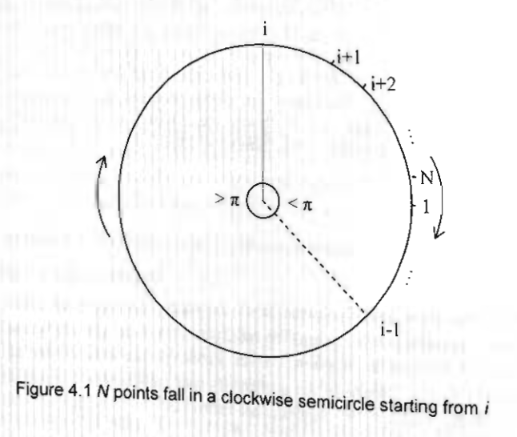
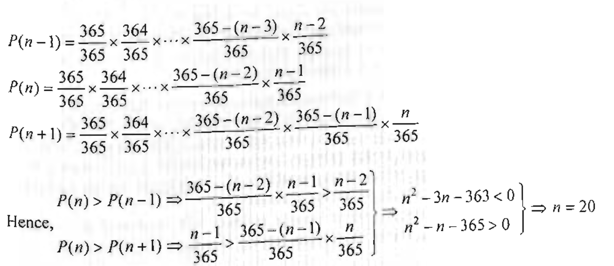
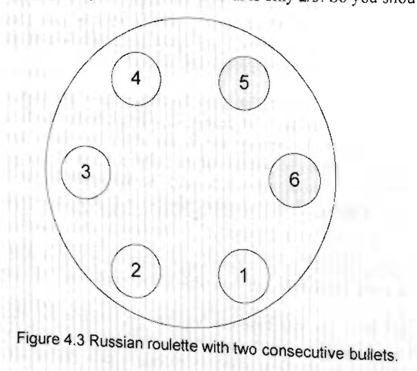
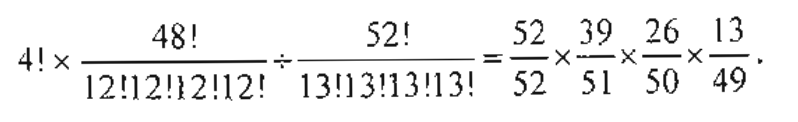
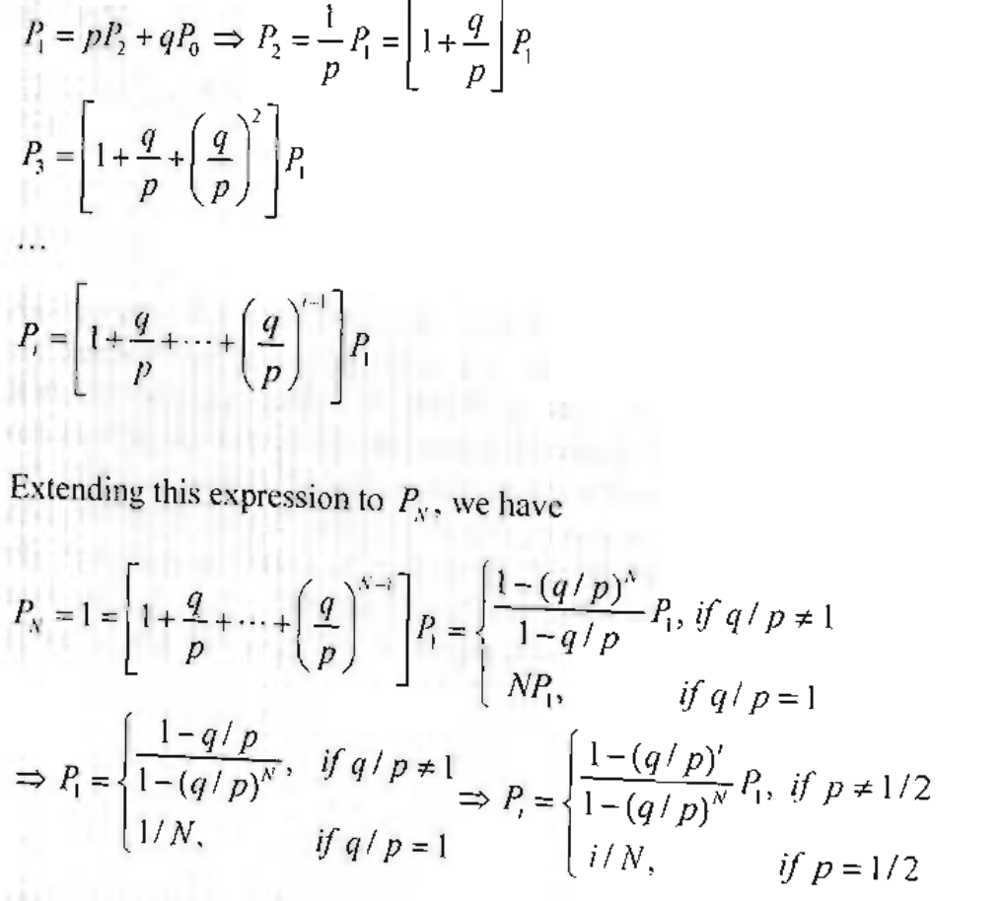
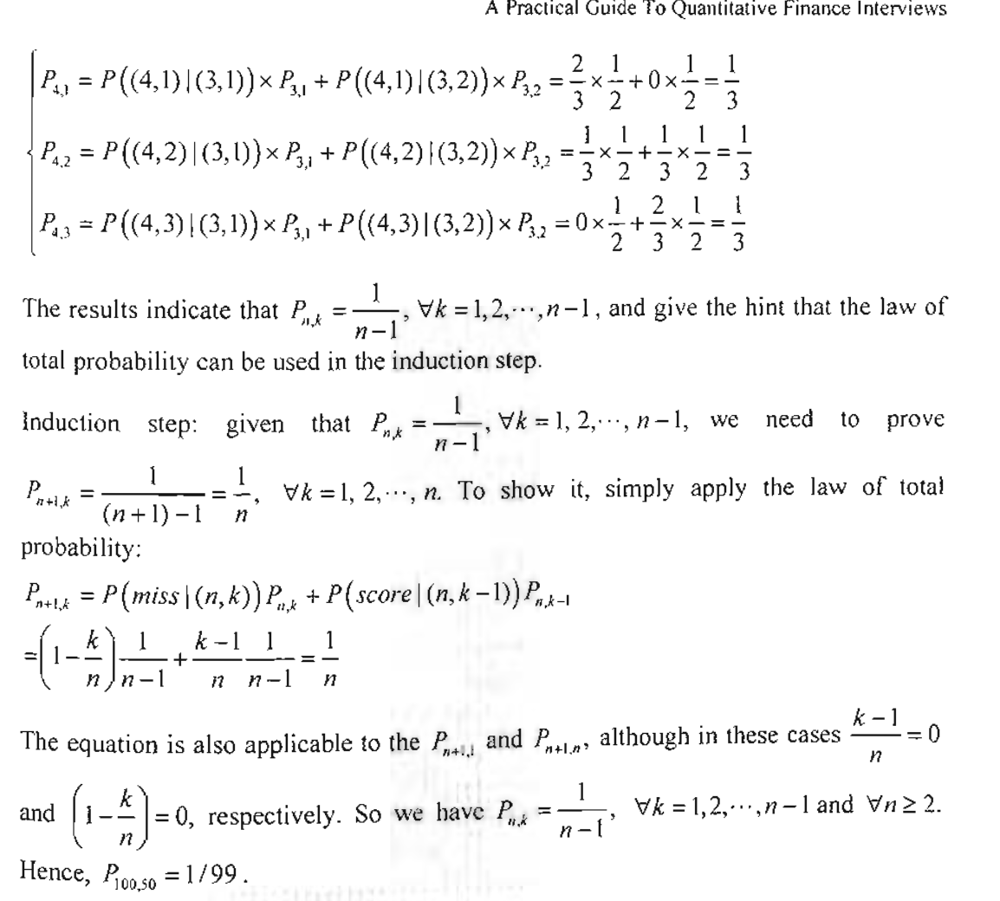

# Chapter 4 Probability Theory
- Chances are that you will face at least a couple of probability problems in most quantitative interviews. Probability theory is the foundation of every aspect of quantitative finance. As a result, it has become a popular topic in quantitative interviews.
- Although good intuition and logic can help you solve many of the probability problems, having a thorough understanding of basic probability theory will provide you with clear and concise solutions to most of the problems you are likely to encounter. Furthermore, probability theory is extremely valuable in explaining some of the seemingly-counterintuitive results. Armed with a little knowledge, you will find that many of the interview problems are no more than disguised textbook problems.
- So we dedicate this chapter to reviewing basic probability theory that is not only broadly tested in interviews but also likely to be helpful for your future career. The knowledge is applied to real interview problems to demonstrate the power of probability theory. Nevertheless, the necessity of knowledge in no way downplays the role of intuition and logic. Quite the contrary, common sense and sound judgment are always crucial for analyzing and solving either interview or real-life problems. As you will see in the following sections, all the techniques we discussed in Chapter 2 still play a vital role in solving many of the probability problems.
- Let's have some fun playing the odds.

## 4.1 Basic Probability Definitions and Set Operations
- First let's begin with some basic definitions and notations used in probability. These definitions and notations may seem dry without examples—which we will present momentarily—yet they are crucial to our understanding of probability theory. In addition, it will lay a solid ground for us to systematically approach probability
problems.
- Outcome (w)
    - the outcome of an experiment or trial.
- Sample space/Probability space (0)
    - the set of all possible outcomes of an experiment.
- Event
    - A set of outcomes and a subset of the sample space. 

### **Coin toss game**
- Two gamblers are playing a coin toss game. Gambler A has (n + 1) fair coins; B has n fair coins. What is the probability that A will have more heads than B if both flip all their coins? 
- Hint: What are the possible results (events) if We compare the number of heads in A's first 17 coins with B's n coins? By making the number of coins equal, we can take advantage of symmetry. For each event, what will happen if A's last coin is a head? Or a tail?

- Solution
    - We have yet to cover all the powerful tools probability theory offers. What do we have now? Outcomes, events, event probabilities, and surely our reasoning capabilities! The one extra coin makes A different from B. If we remove a coin from A, A and B will become symmetric. Not surprisingly, the symmetry will give us a lot of nice properties. So let's remove the last coin of A and compare the number of heads in A's first n coins with B's n coins. There are three possible outcomes:
    - E1
        - A's n coins have more heads than B's n coins;
    - E2 
        - A's n coins have equal number of heads as B's n coins;
    - E3
        - A's ii coins have fewer heads than B's n coins.
    - By symmetry, the probability that A has more heads is equal to the probability that B has more heads. So we have P(E1)= P(E3). Let's denote P(E1) = P(E3)= x and P(E2) = y. Since \sum_{w \in \Omega} P(w) = 1, we have 2x + y = 1. For event E1, A will always have more heads than B no matter what A's (n+1)th coin's side is; for event E3 , A will have no more heads than B no matter what A's (n +1)th coin's side is. For event E2, A's (n+1)th coin does make a difference. If it's a head, which happens with probability 0.5, it will make A have more heads than B. So the (n + 1)th coin increases the probability that A has more heads than B by 0.5y and the total probability that A has more heads is x + 0.5y = x + 0.5(1 - 2x) = 0.5 when A has (n + 1) coins.

### **Card game**
- A casino offers a simple card game. There are 52 cards in a deck with 4 cards for each value 2, 3, 4, 5, 6, 7, 8, 9, 10, J, Q, K, A . Each time the cards are thoroughly shuffled (so each card has equal probability of being selected). You pick up a card from the deck and the dealer picks another one without replacement. If you have a larger number, you win; if the numbers are equal or yours is smaller, the house wins- as in all other casinos, the house always has better odds of winning. What is your probability of winning?
- Solution
    - One answer to this problem is to consider all 13 different outcomes of your card. The card can have a value 2, 3, ..., A and each has 1/13 of probability. With a value of 2, the probability of winning is 0/51; with a value of 3, the probability of winning is 4/51 (when the dealer picks a 2); ...; with a value of A. the probability of winning is 48/51 (when the dealer picks a 2, 3, ..., or K). So your probability of winning is
        - 1/13 * (0/51 + 4/51 + ... + 48/51) = 4/(13 * 51) * (0 + 1 + ... + 12) = 4/(13 * 51) * (12 * 13)/2 = 8/17
    - Although this is a straightforward solution and it elegantly uses the sum of an integer sequence, it is not the most efficient way to solve the problem. If you have got the core spirits of the coin tossing problem, you may approach the problem by considering three different outcomes:
        - E1 : Your card has a number larger than the dealer's;
        - E2: Your card has a number equal to the dealer's;
        - E3: Your card has a number lower than the dealer's.
    - Again by symmetry, P(E1) = P(E3). So we only need to figure out P(E2), the
probability that two cards have equal value, Let's say you have randomly selected a card. Among the remaining 51 cards, only 3 cards will have the same value as your card. So the probability that the two cards have equal value is 3/51. As a result, the probabillty that you win is P(E1) = (1 - P(E2))/2 = (1-3/51)/2 = 8/17

### **Drunk passenger**
- A line of 100 airline passengers are waiting to board a plane. They each hold a ticket to one of the 100 seats on that flight. For convenience, let's say that the n-th passenger in line has a ticket for the seat number n. Being drunk, the first person in line random seat (equally likely for each seat). All of the other passengers are sober, and will go to their proper seats unless it is already occupied; In that ease, they will randomly choose a free seat. You're person number 100. What is the probability that you end up in your seat (i.e. seat #100)
- Solution
    - Let's consider seats #1 and #100. There are two possible outcomes:
        - E1 Seat #1 is taken before #100;
        - E2 : Seat #100 is taken before #1.
    - If any passenger takes seat #100 before #1 is taken, surely you will not end up in you own seat. But if any passenger takes #1 before #100 is taken, you will definitely end up in you own seat. By symmetry, either outcome has a probability of 0.5. So the probability that you end up in your seat is 50%.
    - In case this over-simplified version of reasoning is not clear to you, consider the following detailed explanation: If the drunk passenger takes #1 by chance, then it's clear all the rest of the passengers will have the correct seats. If he takes #100, then you will not get your seat. The probabilities that he takes #1 or #100 are equal. Otherwise assume that he takes the n-th seat, where n is a number between 2 and 99. Everyone between 2 and (n-1) will get his own seal. That means the n-th passenger essentially becomes the new "drunk" guy with designated seat #1. If he chooses #1, all the rest of the passengers will have the correct seats. If he takes #100, then you will not get your seat. (The probabilities that he takes 41 or #100 are again equal.) Otherwise he will just make another passenger down the line the new "drunk" guy with designated seat #1 and each new "drunk" guy has equal probability of taking #1 or #100. Since at all jump points there's an equal probability for the "drunk" guy to choose seat #1 or #100, by symmetry, the probability that you, as the 100-th passenger, will seat in #100 is 0.5.
    
### **N points on a circle**
- Given N points drawn randomly on the circumference of a circle, what is the probability that they are all within a semicircle?
- Hint: Consider the events that starting from a point it, you can reach all the rest of the points on the circle clockwise, n \in {1,...,N} in a semicircle. Are these events mutually exclusive?

- Solution
    - Let's start at one point and clockwise label the points as 1, 2, ..., N. The probability that all the remaining N — 1 points from 2 to N are in the clockwise semicircle starting at point 1 (That is, if point 1 is at 12:00, points 2 to N are all between 12:00 and 6:00) is 1/2^{N-1}. Similarly the probability that a clockwise semicircle starting at any point i, where i \in {2, ..., N} contains all the other N — 1 points is also 1/2^{N-1}
    - Claim: the events that all the other N — 1 points are in the clockwise semicircle starting at point 1, 2, ..., N are mutually exclusive. In other words, if we starting at point i and proceeding clockwise along the circle, sequentially encounters points i+1, i+2,...,  N, 1, ..., i — 1 in half a circle, then starting at any other point j, we cannot encounter all
    other points within a clockwise semicircle. Figure 4.1 clearly demonstrates this conclusion. if starting at point i and proceeding clockwise along the circle, we sequentially encounter points i+1, i+2, ..., N, 1, ..., i—1 within half a circle, the clockwise arc between i—1 and i must be no less than half a circle. If we start at any other point, in order to reach all other points clockwise, the clockwise arc between and i are always included. So we cannot reach all points within a clockwise semicircle starting from any other points. Hence, all these events are mutually exclusive and we have
        - P(\bigcup_{i=1}^N E_i) = \bigcup_{i=1}^N P(E_i) => P(\bigcup_{i=1}^N) = N * 1/2^{N-1} = N/2^{N-1}
    - The same argument can be extended to any arcs that have a length less than half a circle. If the ratio of the arc length to the circumference of the circle is x (X <= 1/2), then the probability of all N points fitting into the arc is N * X^{N-1}
    - 

## 4.2 Combinatorial Analysis
- Many problems in probability theory can be solved by simply counting the number of different ways that a certain event can occur. The mathematic theory of counting is often referred to as combinatorial analysis (or combinatorics). In this section. we will cover the basics of combinatorial analysis.
Basic principle of counting: Let S be a set of length-k sequences. If there are 
    - n1 possible first entries,
    - n2 possible second entries for each first entry,
    - n3 possible third entries for each combination of first and second entries, etc. Then there are a total of n1 * n2 ... * nk possible outcomes.
- Permutation
    - A rearrangement of objects into distinct sequence (i.e., order matters).
    - Property
        - There are	n!/(n1! n2! ... nr !) different permutations of n objects of which n1 are alike, n2 are alike, ... , nr are alike.
- Combination
    - An unordered collection of objects (i.e., order doesn't matter).
    - Property: There are \binom{n}{r} = n!/(n-r)!r! different combinations of n distinct objects taken r at a time
- binomial theorem
    - (x+y)^n = \sum_{k=0}^n \binom{n}{k} x^k y^{n-k}
- inclusion-exclusion principle
    - P(E1 \cup E2) = P(E1) + P(E2) - P(E1E2)


### **Poker hands**
- Poker is a card game in which each player gets a hand of 5 cards. There are 52 cards in a deck. Each card has a value and belongs to a suit. There are 13 values, 2, 3, 4, 5, 6, 7, 8, 9, 10, J, Q, K, A, and four suits, spade, club, heart, diamond
- What are the probabilities of getting hands with four-of-a-kind (four of the five cards with the same value)? Hands with a full house (three cards of one value and two cards of another value)? Hands with two pairs?
- Solution
    - The number of different hands of a five-card draw is the number of 5-element subsets of a 52-clement set, so total number of hands = \binom{52}{5} = 2598960
    - Hands with a four-of-a-kind
        - First we can choose the value of the four cards with the same value, there are 13 choices. The 5th card can be any of the rest 48 cards (12 choices for values and 4 choices for suits). So the number of hands with four-of-a kind is 13 * 48 = 624.
    - Hands with a Full House: In sequence we need to choose the value of the triple. 13 choices; the suits of the triple, \binom{4}{3} choices; the value of the pair, 12 choices; and the suits of the pair \binom{4}{2} choices. So the number of hands with full house is 13 * \binom{4}{3} * 12 * \binom{4}{2} = 13 * 4 * 12 * 6 = 3744
    - hands with two pairs: In sequence we need to choose the values of the two pairs, \binom{13}{2} choices; the suits of the firs pair, \binom{4}{2} choices; the suits of the second pair, \binom{4}{2} choicesl and the ramining card, 44 (52 - 4 * 2, since the last cards can not have the same value as either pair) choices. So the number of hands with two pairs is \binom{13}{2} * \binom{4}{2} * \binom{4}{2} * 44 = 78 * 6 * 6 * 44 = 123552
    - to calculate the probability of each, we only need to divide the number of hands of each kind by the total possible number of hands

### **Hopping rabbit**
- A rabbit sits at the bottom of a staircase with n stairs. The rabbit can hop up only one ortwo stairs at a tilne, How many different ways are there for the rabbit to ascend to top of the stairs?
- Hint: Consider an induction approach. Before the final hop to reach the n-th stair, the rabbit can be at either the (n-1)-th stair of the (n-2)-th stair assuming n > 2
- Solution
    - Let's begin with the simplest cases and consider solving the problem for any number of stairs using induction. For n = 1 , there is only one way and f (1) = 1. For n = 2, we can have one 2-stair hop or two 1-stair hops. So f(2) = 2. For any n > 2, there are always two possibilities for the last hop, either it's a 1-stair hop or a 2-stair bop. In the former case, the rabbit is at (n-1) before reaching n, and it has f(n —1) ways to reach (n-1). In the latter case, the rabbit is at (n-2) before reaching n, and it has f(n — 2) ways to reach (n - 2). So we have f (n) = f(n — 2) + f n —1). Using this function we can calculate f (n) for n = 3, 4, ...


### **Screwy pirates 2**
- Having peacefully divided the loot (in chapter 2), the pirate team goes on for more looting and expands the group to II pirates. To protect their hard-won treasure, they gather together to put all the loot in a safe. Still being a democratic bunch, they decide that only a majority — any majority — of them (>= 6) together can open the safe. So they ask a locksmith to put a certain number of locks on the safe. To access the treasure, every lock needs to be opened. Each lock can have multiple keys; but each key only opens one lock. The locksmith can give more than one key to each pirate.
- What is the smallest number of locks needed? And how many keys must each pirate carry?
- Hint: every subgroup of 6 pirates should have the same key to a unique lock that the other 5 pirates do not have.

- Solution
    - This problem is a good example of the application of combinatorial analysis in information sharing and cryptography. A general version of the problem was explained in a 1979 paper "How to Share a Secret" by Adi Shamir. Let's randomly select 5 pirates from the 11-member group; there must be a lock that none of them has the key to. Yet any of the other 6 pirates must have the key to this lock since any 6 pirates can open all locks. In other words, we must have a "special" lock to which none of the 5 selected pirates has a key and the other 6 pirates all have keys. Such 5-pirate groups are randomly selected. So for each combination of 5 pirates, there must be such a "special" lock. The minimum number of locks needed is \binom{11}{5} = 462 locks. Each lock has 6 keys, which are given to a unique 6-member subgroup. So each pirate must have 462 * 6 / 11 = 252 keys. That's surely a lot of locks to put on a safe and a lot of keys for each pirate to carry.

## Chess tournament
A chess tournament has 2^n players with skills 1 > 2 > ... > 2^n. It is organized as a knockout tournament, so that after each round only the winner proceeds to the next round. Except for the final, opponents in each round are drawn at random. Let's also assume that when two players meet in a game, the player with better skills always wins. What's the probability that players 1 and 2 will meet in the final?
- Hint: Consider separating the players to two 2^{n-1} subgroups. What will happen if player 1 and 2 in the same group? Or not in the same group?	
- Solution
    - There are at least two approaches to solve the problem. The standard approach applies multiplication rule based on conditional probability, while a counting approach is far more efficient. (We will cover conditional probability in detail in the next section.) Let's begin with the conditional probability approach, which is easier to grasp. Since there are 2" players. the tournament will have n rounds (including the final). For round 1, players 2, 3, ..., 2^n each have 1/(2^n - 1) probability to be 1's rival, so the probability that 1 and 2 do not meet in round 1 is (2^n - 2)/(2^n - 1) = (2 * (2^{n-1} - 1))/(2^n - 1). Condition on that 1 and 2 do not meet in round 1. 2^{n-1} players proceed to the 2nd round and the conditional probability that 1 and 2 will not meet in round 2 is (2^{n-1} - 2)/(2^{n-1} - 1) = (2 * (2^{n-2} - 1))/(2^{n-1} - 1). We can repeat the same process until the (n-1)-th round, in which there are 2^2 (= 2^n / 2^{n-2}) players left and the conditional probability that 1 and 2 will not meet inround (n — 1) is (2^2 - 2)/(2^2 - 1) = (2 * (2^{2-1} - 1))/(2^2 - 1)
    - Let E1 be the event that 1 and 2 do not meet in round 1;
    - Let E2 be the event that I and 2 do not meet in rounds 1 and 2;
    ...
    - Let E_{n-1} be the the event that 1 and 2 do not meet in round	n —1
    - Apply the multiplication rule. we have P(1 and 2 meet in the n-th game) = P(E1) * P(E2 | E1) * ... * P(E_{n-1} | E1 E2 ... E_{n-2})
    = (2 * (2^{n-1} - 1))/(2^n - 1) * (2 * (2^{n-2} - 1))/(2^n - 1) * ... * (2 * (2^{2-1} - 1))/(2^2 - 1) = 2^{n-1}/(2^n - 1)
    - Now let's move on to the counting approach. Figure 4.2A is the general case of what happens in the final. Player 1 always wins, so he will be in the final. From the figure, it is obvious that 2^n players are separated to two 2^{n-1}-player subgroups and each group will have one player reaching the final. As shown in Figure 4.2B, for player 2 to reach the final, he/she must be in a different subgroup from I . Since any of the remaining players in 2,3,..., 2^n are likely to be one of the (2^{n-1} — 1) players in the same subgroup as player 1 or one of the 2^{n-1} players in the subgroup different from player 1, the probability that 2 is in a different subgroup from 1 and that 1 and 2 will meet in the final is simply (2^{n-1})/(2^n - 1). Clearly, the counting approach provides not only a simpler solution but also more insight to the problem.
    - 

### **Application letters*
- You're sending job applications to 5 firms: Morgan Stanley, Lehman Brothers, UBS, Goldman Sachs, and Merrill Lynch. You have 5 envelopes on the table neatly typed with names and addresses of people at these 5 firms. You even have 5 cover letters personalized to each of these firms. Your 3-year-old tried to be helpful and stuffed each cover letter into each of the envelopes for you. Unfortunately she randomly put letters
- Hint: the complement is that at keast oen ketter is mailed to the correct firm.
- Solution
    - This problem is a classic example for the Inclusion-Exclusion Principle. In fact, a more general case is an example in Ross' textbook First Course in Probability.
    - Let's denote by E_i, i =1, ..., 5 the event that the i-th letter has the correct envelope. Then P(\bigcup_{i=1}^5 E_i) is the probability that at least one letter has the correct envelope and 1 - P(\bigcup_{i=1}^5 E_i) is the probability that all letters have the wrong envelopes, P(\bigcup_{i=1}^5 E_i) can be calculated using the Inclusion-Exclusion Principle:
        - P(\bigcup_{i=1}^5 E_i) = \sum_{i=1}^5 P(E_i) - \sum_{i_1 < i_2} P(E_{i_1} E_{i_2}) + ... + (-1)^6 P(E_1 E_2 ... E_5)
    - It's obvious that P(E_i) = 1/5, \any i = 1, ..., 5. So \sum_{i=1}^5 P(E_i) = 1
    - P(E_{i_1} E_{i_2}) is the event that both letter i_1 and letter i_2 have the correct envelope. The probability that i_1 has the correct envelope is 1/5; Conditioned on that i_1 has the correct envelope, the probability that i_2 has the corrrect envelope is 1/4 (there are only 4 envelopes left), So P(E_{i_1}E_{i_2}) = 1/5 * 1/(5-1) = (5-2)!/5!
    - There are \binom{5}{2} = 5!/2!(5-2)! members of P(E_{i_1} E_{i_2}) in \sum_{i_1 < i_2} P(E_{i_1} E_{i_2}), so we have \sum_{i_1 < i_2} P(E_{i_1}E_{i_2}) = (5-2)!/5! * 5!/(2! (5-2)!) = 1/2!
    - Similarly we have \sum_{i_1 < i_2 < i_3} P(E_{i_1} E_{i_2} E_{i_3}) = 1/3!, \sum_{i_1 < i_2 < i_3 < i_4} P(E_{i_1} E_{i_2} E_{i_3} E_{i_4}) = 1/4!, and .... = 1/5!
    - Therefore, P(\bigcup_{i=1}^5 E_i) = 1 - 1/2! + 1/3! - 1/4! + 1/5! = 19/30
    - So the probability that all 5 letters re mailed to the wrong firm is 1 -  P(\bigcup_{i=1}^5 E_i) = 11/30

### **Birthday problem**
- How many people do we need in a class to make the probability that two people have the same birthday more than 1/2? (For simplicity, assume 365 days a year.)
- Solution
    - The number is surprisingly small: 23. Lets say we have n people in the class. Without any restrictions, we have 365 possibilities for each individual's birthday. The basic principle of counting tells us that there are 365^n possible sequences.
    - We want to find the number of those sequences that have no duplication of birthdays. For the first individual, we can choose any of the 365 days; but for the second, only 364 remaining choices left, ..., for the r-th individual, there are 365 – r +1 choices. So for n people there are 365 * 364 * ...* (365– n +1)  possible sequences where no two individuals have the same birthday. We need to have	365 * 364 * ...* (365– n +1) / 365^n < 1/2 for the odds to be in our favor. The smallest such n is 23.

### **100th digit**
- What is the 100th digit to the right of the decimal point in the decimal representation of (1 + \sqrt{2})^3000?

- Solution
    - If you still have not figure out the solution from the hint, here is one more hint: (1 + \sqrt{2}) + (1 - \sqrt{2})is an integer when n = 3000 .
    - Applying the binomial theorem for (x + y)^n , we have
    - 
    - 

### **Cubic of integer**
- Let x be an integer between 1 and 10^12, what is the probability that the cubic of x ends with 11?
- Hint: The last two digits of x^3 only depend on the last two digits of x
- Solution 
    - All integers can be expressed as x = a + 1Ob, where a is the last digit of x. Applying the binomial theorem, we have x3 = (a+10b)^3 = a^3 +30a^2b + 300ab^2 + 1000b^3.
    - The unit digit of x^3 only depends on a^3. So a^3 has a unit digit of 1. Only a = 1 satisfies this requirement and a^3 =1. Since a63 =1, the tenth digit only depends on 30a^2b = 30b
    - So we must have that 3b ends in 1, which requires the last digit of b to be 7
    - Consequently, the last two digits of x should be 71, which has a probability of 1% for integers between 1 and 10^12.

## 4.3 Conditional Probability and Bayes' formula
- Many financial transactions an responses to probability adjustments based on new—and most likely incomplete—information. Conditional probability surely is one of the most popular test subjects in quantitative interviews. So in this section, we focus on basic conditional probability definitions and theorems.
- conditional probability
- multiplication rule
- law of total probability
- independent events
- bayes' formula

### ** Boys and girls
Part A. A company is holding a dinner for working mothers with at least one son. Ms. Jackson, a mother with two children, is invited. What is the probability that both children are boys
- Solution
    - The sample space of two children is given by \Omega = {(b,b), (b,g), (g,b),(g,g)}, (e.g. (g,b) means the older child is a girl and the younger child a boy), and each outcome has the same probability. Since Ms.Jackson is invited, she has at least one son. Let B be the event that at least one of the children is a boy and A be the event that both children are boys, we have
        - P(A|B) = P(A \cap B)/P(B) = P({(b,b)})/P({(b,b), (b,g), (g,b)}) = (1/4)/(3/4) = 1/3

- Part B. your new colleague, Ms. Parker is known to have two children. If you see her walking with one of her children and that child is a boy, what is the probability that both children are boys?
- Solution
    -  the other child is equally likely to be a boy or a girl (independent of the boy you've seen), so the probability that both children are boys is 1/2.
    - Notice the subtle difference between part A and part B. In part A. the problem essentially asks given there is at least one boy in two children, what is the conditional probability that both children are boys. Part B asks that given one child is a boy, what is the conditional probability that the other child is also a boy. For both parts. we need to assume that each child is equal likely to be a boy or a girl.

### **All-girl world?**
- In a primitive society, every couple prefers to have a baby girl. There is a 50% chance that each child they have is a girl, and the genders of their children are mutually independent. If each couple insists on having more children until they get a girl and once they have a girl they will stop having more children, what will eventually happen to the fraction of girls in this society?
- Solution
    - It was surprising that many interviewees —- include many who studied probability -- have the misconception that there will be more girls. Do not let the word "prefer" and a wrong intuition misguide you. The fraction of baby girls are driven by, nature, or at least the X and Y chromosomes, not by the couples' preference. You only need to look at the key information: 50% and independence, Every new-born child has equal probability of being a boy or a girl regardless of the gender of any other children. So the fraction of girls born is always 50% and the fractions of girls in the society will stay stable at 50%.

### **Unfair coin**
- You are given 1000 coins. Among them, I coin has heads on both sides. The other 999 coins are fair coins. You randomly choose a coin and toss it 10 times. Each time, the coin turns up heads. What is the probability that the coin you choose is the unfair one,
- Solution
    - This is a classic conditional probability question that uses Bayes' theorem, Let A be the event that the chosen coin is the unfair one, then A^c is the event that the coin is a fair one. Let B be the event that all ten tosses turn up heads. Apply Bayes' theorem we have 
        - P(A|B) = P(B|A)P(A)/P(B) = P(B|A)P(A)/(P(B|A)P(A) + P(B|A^c)P(A^c))
    - The priors are P(A) = 1/1000 and P(A^c) 999/1000. If the coin is unfair, it always turns up heads. so P(B|A) = 1. If the coin is fair each time it has 1/2 probability turning up heads. So P(B|A^c) = (1/2)^{10} = 1/1024. Plug in all the available information and we have the answer
        - P(A|B) = P(B|A)P(A) / (P(B|A)P(A) + P(B|A^c)P(A^c)) = 1/1000*1/(1/1000*1 + 999/1000 * 1/1024) ~= 0.5

### **Fair probability from an unfair coin**
- If you have an unfair coin, which may bias toward either heads or tails at an unknown probability, can you generate even odds using this coin?
- Solution
    - Unlike fair coins, we clearly can not generate even odds with one toss using an unfair coin. How about using 2 tosses? Let p1 be the probability the coin will yield head, and Pr be the probability the coin will yield tails ( p_H + p_T Consider two independent tosses. We have four possible outcomes HH, HT, TH and TT with probabilities P(HH) = p_Hp_H, P(HT) = p_Hp_T, P(TH) = p_Tp_H, P(TT) = p_Tp_T
    - So we have P(HT)= P(TH). By assigning HT to winning and TH to losing, we can generate even odds.

### **Dart game**
- Jason throws two darts at a dartboard, aiming for the center. The second dart lands farther from the center than the first. If Jason throws a third dart aiming for the center, what is the probability that the third throw is farther from the center than the first? Assume Jason's skillfulness is constant.
- Solution
    - A standard answer directly applies the conditional probability by enumerating all possible outcomes. If we rank the three darts' results from the best (A) to the worst (C), there are 6 possible outcomes with equal probability:
    - 
    ```
    Outcome   1 2 3 4 5 6
    1st throw A B A C B C
    2nd throw B A C A C B 
    3rd throw C C B B A A 
    ```
    - The information from the first two throws eliminates outcomes 2, 4 and 6. Conditioned on outcomes 1, 3, and 5, the outcomes that the 3rd throw is worse than the 1st throw are outcomes 1 and 3. So there is 2/3 probability that the third throw is farther from the center than the first.
    - This approach surely is reasonable. Nevertheless, it is not an efficient approach. When the number of darts is small, we can easily enumerate all outcomes. What if it is a more complex version of the original problem:
    - Jason throws n (n >= 5) darts at a dartboard, aiming for the center. Each subsequent dart is farther from the center than the first dart. If Jason throws the (n + 1)th dart. what is the probability that it is also farther from the center than his first?
    - This question is equivalent to a simple question: what is the probability that the (n+1)-th throw is not the best among all (n+1) throws? Since the 1st throw is the best among the first n throws, essentially I am saving the event that the (n+1)th throw is the best of all (n+1) throws (let's call it A_{n+1}) is independent of the event that the 1st throw is the best of the first n throws (let's call it A_1). In fact, A_{n+1}, is independent of the order of the first n throws. Are these two events really independent? The answer is a resounding yes. If it is not obvious to you that A_{n+1} is independent of the order of the first n throws, let's look at it another way: the order of the first n throws is independent of A_{n+1}. Surely this claim is conspicuous. But independence is symmetric! Since the probability of A_{n+1} is 1/(n +1), the probability that (n+1)-th throw is not the best is n/(n+1).
    - Hint: here you can again use symmetry argument: each throw is equally likely to be the best.
    - For the original version. three darts are thrown independently, they each have a 1/3 chance of being the best throw. As long as the third dart is not the best throw, it will be worse than the first dart. Therefore the answer is 2/3.

### **Birthday line**
- At a movie theater, a whimsical manager announces that she will give a free ticket to the first person in line whose birthday is the same as someone who has already bought ticket. You are given the opportunity to choose any position in line. Assuming that you don't know anyone else's birthday and all birthdays are distributed randomly throughout the year (assuming 365 days in a year), what position in line gives you the largest chance of getting the free ticket?
- Hint: If you are the n-th person in kine, to get the free ticket, the first (n-1) people in line must not have the same birthday and you must have the same birthday as one of them.
- Solution
    - If you have solved the problem that no two people have the same birthday in an n-people group, this new problem is just a small extension. Assume that you choose to be the n-th person in line. In order for you to get the free ticket, all of the first n-1 individuals in line must have different birthdays and your birthday needs to be the same as one of those n -1 individuals.
    - p(n) = p(first n -1 people have no same birthday) * p(yours among those n - 1 birthdays) 365 * 364 * ... * (365 - n + 2)/365^{n-1} * (n-1)/365
    - It is intuitive to argue that when n is small, increasing n will increase your chance of getting the free ticket since the increase of p(yours among those n-1 birthdays) is more significant than the decrease in p(firsi n-1 people have no sa,e birthday). So when n is small, we have P(n) > P(n-1). As n increases, gradually the negative impact of p(first n -1 people haven same birthday) will catch up and at a certain point we will have P(n+1) < P(n). So we need to find such an n that satisfies P(n) > P(n-1) and P(n) > P(n+1).
    - 
    - You should be the 20th person in line

### **Dice order**
- We throw 3 dice one by one. What is the probability that we obtain 3 points in strictly increasing order?
- Solution
    - To have 3 points in strictly increasing order, first all three points must be different numbers. Conditioned on three different numbers, the probability of strictly increasing order is simply 1/3! = 1 /6 (one specific sequence out of all possible permutations). So we have
    - P = P(diffcrent numbers in all three throws) x P(increasing order | 3 different numbers) - (1 * 5/6 * 4/6) * 1/6 = 5/54

### **Monty Hall problem**
-Monty Hall problem is a probability puzzle based on an old American show Lei is Make a Deal . The problem is named after the show's host. Suppose you're on the show now, and you're given the choice of 3 doors. Behind one door is a car; behind the other two, goats. You don't know ahead of time what is behind each of the doors.
- You pick one of the doors and announce it. As soon as you pick the door, Monty opens one of the other two doors that he knows has a goat behind it. Then he gives you the option to either keep your original choice or switch to the third door. Should you switch? What is the probability of winning a car if you switch?
- Solution 
    - If you don't switch, whether you win or not is independent of Monty's action of showing you a goat, so your probability of winning is 1/3. What if you switch? Many Nvould argue that since there are only two doors left after Monty shows a door with goat. the probability of winning is 1/2. But is this argument correct?
    - If you look at the problem from a different perspective, the answer becomes clear. Using a switching strategy, you win the car if and only if you originally pick a door with a goat. which has a probability of 2/3 (You pick a door with a goat, Monty shows a door With another goat, so the one you switch to must have a car behind it). If you originally, picked the door with the car, which has a probability of 1/3, you will lose by switching. So your probability of winning by switching is actually 2/3.

### **Amoeba population**
- There is a one amoeba in a pond. After every minute the_ amoeba may die. stay  the same, split into two or split into three with equal probability:ji its offspring, if it has any, will behave the same (and independent of other amoebas). What is the probability the amoeba population will die out?
- Solution
    - This is just another standard conditional probability problem once you realize we need to derive the probability conditioned on what happens to the amoeba one minute later. Let P(E) be the probability that the amoeba population will die out and apply the law of total probability conditioned on what happens to the amoeba one minute later:
        - P(E) = P(E|F1)P(F1) + P(E|F2)P(F2)+ ...+ P(E|Fn)P(Fn)
    - For the original amoeba, as stated in the question, there are four possible mutually exclusive events each with probability 1/4. Let's denote F1, as the event the amoeba dies;
    - F2 as the event that it stays the same; F3 as the event that it splits into two; F4 as the event that it splits into three. For event F1, P(E|F1) = 1 since no amoeba is left. P(E|F2) = P(E) since the state is the same as the beginning. For F3, there are two amoebas; either behaves the same as the original one. The total amoeba population will die only if both amoebas die out. Since they are independent, the probability that they both will die out is P(E)^2. Similarly we have P(F4) = P(E). Plug in all the numbers, the equation becomes P(E) = 1/4 * 1 + 1/4 * P(E) + 1/4 x P(E)^2 + 1/4x P(E)^3. Solve this equation with the restriction 0 < P( E) < I, and we will get P(E) = \sqrt{2} - 1 = 0.414 (The other two roots of the equation are 1 and — \sqrt{2} - 1).

### **Candies in a jar**
- You are taking out candies one by one from a jar that has 10 red candies, 20 blue candies, and 30 green candies in it. What is the probability that there are at least 1 blue candy and 1 green candy left in the jar when you have taken out all the red candies.
- Solution
    - At first look, this problem appears to be a combinatorial one. However, a conditional probability approach gives a much more intuitive answer. Let T_r, T_h and T_g be the number that the last red, blue, and green candies are taken out respectively. To have at least 1 blue candy and 1 green candy left when all the red candies are taken out, we need to have T_r < T_h and T_r < T_g. In other words, we want to derive P(T_r < T_h \cap t_r < T_g). There are two mutually exclusive events that satisfy T_r < T_h and T_r < T_g : T_r < T_h < T_g and T_r < T_g < T_h.
    - Therefore, P(T_r < T_h \cap t_r < T_g) = P(T_r < T_h < T_g) + P(T_r < T_g < T_h)
    - T_r < T_h < T_g means that the last candy is green (T_g = 60). Since each of the 60 candies are equally likely to be the last candy and among them 30 are green ones, we have P(T_g = 60) = 30/60. Conditioned on T_g = 60, we need P(T_r < T_h | T_g = 60). Among the 30 red and blue candies, each candy is again equally likely to be the last candy and there are 20 blue candies, so P(T_r < T_h | T_g = 60) = 20/30 and P(T_r < T_h < T_g) = 30/60 * 20/30. Similarly, w ehave P(T_r < T_g < T_h) = 20/60 * 30/40
    - Hence, P(T_r < T_h \cap t_r < T_g) = P(T_r < T_h < T_g) + P(T_r < T_g < T_h) = 30/60 * 20/30 + 20/60 * 30/40 = 7/12

### **Coin toss game**
- Two players, A and B, alternatively toss a fair coin (A tosses the coin first, then B tosses the coin, then A, then B...). The sequence of heads and tails is recorded. If there is a head followed by a tail (HT subsequence), the game ends and the person who tosses the tail wins. What is the probability that A wins the ganne?
- Hint: condition on the result of A's first toss and use symmetry
- Solution
    - Let P(A) be the probability that A wins; then the probability that B wills is P(B) = 1 - P(A). Let's condition P(A) on A's first toss, which has 1/2 probability of H (heads) and 1/2 probability of T (tails).
    - P(A) = 1/2 P(A|H) + 1/2 P(A|T)
    - If A's first toss is T, then B essentially becomes the first to toss (An H is required for the HT subsequence), So we have P(A|T)	= P(B) = 1 - P(A) 
    - If A's first toss ends in H, lees further condition on B's first toss. B has 1/2 probability of getting T; in that case A loses. For the 1/2 probability that B gets H, B essentially becones the first one to toss an H. In that case, A has (1 - P(A|H)) probability of winning . So P(A|H) = 1/2 * 0 + 1/2(1-P(A|H)) => P(A|H) = 1/3
    - Combining all the available information, we have
    - P(A) = 1/2 * 1/3 + 1/2(1-P(A)) => P(A) = 4/9
    - Sanity check
        - we can see that P(A) < 1/2, which is reasonable since A cannot win in his first toss, yet B has 1/4 probability to win in her first toss.


### **Russian roulette series**
- Let's play a traditional version of Russian roulette. A single bullet is put into a 6-chamber revolver. The barrel is randomly spun so that each chamber is equally likely to be under the hammer. Two players take turns to pull the trigger -- with the gun unfortunately pointing at one's own head -- without further spinning until the gun goes off and the person who gets killed loses. If you, one of the players, can choose to go first for second, how will you choose? And what is your probability of loss?
- Solution
    - Marty people have the wrong impression that the first person has higher probability of loss. After all, the first player has a 1/6 chance of getting killed in the first round before the second player starts. Unfortunately, this is one of the few times that intuition is wrong. Once the barrel is spun, the position of the bullet is fixed. If you go first, you lose if and only if the bullet is in chamber 1, 3 and 5. So the probability that you lose is the same as the second player, 1/2. In that sense, whether to go first or seco does not matter.

- Now, let's change the rule slightly. We will spin the barrel again after every trigger pull. Will you choose to be the first or the second player? And what is your probability of loss? 
- Solution
    - The difference is that each run now becomes independent. Assume that the first player's probability of losing is p, then the second player's probability of losing is 1–p. Let's condition the probability on the first person's first trigger pull. He has 1/6 probability of losing in this run. Otherwise, he essentially becomes the second player in the game with new (conditional) probability of losing 1– p. That happens with probability of 5/6. That gives us p = 1 * 1/6 + (1-p) * 5/6 => p = 6/11. So you should choose to be the second player and have 5/11 probability of losing.

- If instead of one bullet, two bullets are randomly put in the chamber. Your opponent played the first and he was alive after the first trigger pull. You are given the option whether to spin the barrel. Should you spin the barrel?
- Solution
    - if you spin the barrel, the probability that you will lose in this round is 2/6.1i you don't spin the barrel, there are only 5 chambers left and your probability of losing in this round (conditioned on that your opponent survived) is 2/5. So you should spin the barrel.
- What if the two bullets are randomly put in two consecutive positions? If your opponent survived his first round, should you spin the barrel?
- Solution
    - Now we have to condition our probability on the fact that the positions of the two bullets are consecutive. As shown in Figure 4.3, let's label the empty chambers as 1, 2, 3 and 4; label the ones with bullets 5 and 6. Since your opponent survived the first round, the possible position he encountered is 1, 2, 3 or 4 with equal probability. With 1/4 chance, the next one is a bullet (the position was 4). So if you don't spin, the chance of survival is 3/4. If you spin the barrel, each position has equal probability of being chosen, and your chance of survival is only 2/3. So you should not spin the barrel.
    - 

### **Aces**
- Fifty-two cards arc randomly distributed to 4 players with each player getting 13 cards. What is the probability that each of them will have an ace?
- Solution
    - The problem can be answered using standard counting methods. To distribute 52 cards to 4 players with 13 cards each has 52!/13!13!13!13! permutations. If each
    needs to have one ace, we can distribute the aces first, which has 4! ways. Then we player needs to have one ace, we can distribute the rest 48 cards to 4 players with 12 cards each, which has 48!/12!12!12! permutations. So the probability that each of them will have an Ace is
        - 
    - The logic becomes clearer if we use a conditional probability approach. Let's begin with any one of the four aces; it has probability 52/52 = 1 of belonging to a pile, The second ace can be any of the remaining 51 cards, among which 39 belong to a pile different from the first ace. So the probability that the second ace is not in the pile of the first ace is 39 /51. Now there are 50 cards left, among which 26 belong to the other two piles. So the conditional probability that the third ace is in one of the other 2 piles given the first two aces are already in different piles is 26/50. Similarly, the conditional probability that the fourth ace is in the pile different from the first three aces given that the first three aces are in different piles is 13/49 . So the probability that each pile has an ace is 1 * 39/51 * 26/50 * 13/49

### **Gambler's ruin problem**
- A gambler starts with an initial fortune of i dollars. On each successive game, the gambler wins $1 with probability p, 0 < p < 1, or loses $1 with probability q = 1–p. He will stop if he either accumulates N dollars or loses all his money. What is the probability that he will end up with N dollars? 
- Solution
    - This is a classic textbook probability problem called the Gambler's Ruin-Problem. Interestingly, it is still widely used in quantitative interviews.
    - From any initial state i (the dollars the gambler has), 0	<= i <= N, let P_i be the probability that the gambler's fortune will reach N instead of 0. The next state is either i+1 with probability p or i –1 with probability q. So we have 
        - P_i = p P_{i+1} + q P_{i-1} => P_{i+1} - P_i = q/p (P_i - P_{i-1}) = (q/p)^2 (P_{i-1} - P_{i-2}) = ... = (q/p)^i (P_1 - P_0)
    - We also have the boundary probabilities P_0 = 0 and P_N = 1.
    - So starting from P_2, we can successively evaluate P_i, as an expression of P_1,
    - 

### **Basketball scores**
- A basketball player is taking 100 free throws. She scores one point if the ball passes, through the hoop and zero point if she misses. She has scored on her first throw and missed on her second. For each of the following throw the probability of her scoring is the fraction of throws she has made so far. For example, if she has scored 23 points after the 40th throw, the probability that she will score in the 41th throw is 23/40. After 100 throws (including the first and the second), what is the probability that she scores exactly 50 baskets?
- Hint: Again, do not let the nturiber 100 scares you. Start with smallest n, try to find a pattern by increasing n; and prove the pattern using induction
- Solution
    - Let (n,k), 1 <= k <= n, be the event that the player scores k baskets after n throws and P_{n,k} = P((n,k)). The sotution is surprisingly simple if we use an induction approach starting with n = 3. The third throw has 1/2 probability of scoring. So we have P_{3,1} = 1/2 and P_{3,2} = 1/2. For the case when n = 4, let's apply the law of total probability
    - 

### **Cars on road**
- If the probability of observing at least one car on a highway during any 20-minute time interval is 609/625, then what is the probability of observing at least one car during any 5-minute time interval? Assume that the probability of seeing a car at any moment is uniform (constant) for the entire 20 minutes.
- Solution
    - We can break down the 20-minute interval into a sequence of 4 non-overlapping 5-minute intervals. Because of constant default probability (of observing a car), the probability of observing a car in any 5-minute interval is constant. Lets denote the probability to he p, then the probability that in any 5-minute interval we do not observe a car is 1— p.
    - The probability that we do not observe any car in all four of such independent 5-minute intervals is (1-p)^4 = 1 - 609/625 = 16/625, which gives p = 3/5
