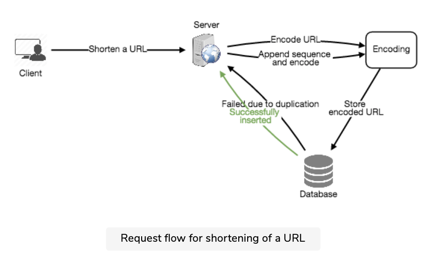

https://www.educative.io/courses/grokking-the-system-design-interview?affiliate_id=5749180081373184/

# names of large numbers
- 1 KB = 1024 bytes = 10^3 bytes | kilobytes
- 1 MB = 1024 KB = 10^6 bytes | megabytes
- 1 GB = 10^9 bytes | gigabytes
- 1 TB = 10^12 bytes | terabytes
- 1 PB = 10^15 bytes | petabytes

# Interview Process
- Scope the problem
  - Don’t make assumptions.
  - Ask clarifying questions to understand the constraints and use cases.
  - Steps
    - Requirements clarifications
    - System interface definition
- Sketch up an abstract design
  - Building blocks of the system
  - Relationships between them
  - Steps
    - Back-of-the-envelope estimation
    - Defining data model
    - High-level design
- Identify and address the bottlenecks
  - Use the fundamental principles of scalable system design
  - Steps
    - Detailed design
    - Identifying and resolving bottlenecks

# Designing a URL Shortening service like TinyURL
## Why do we need URL shortening?
- URL shortening is used for optimizing links across devices, tracking individual links to analyze audience and campaign performance, and hiding affiliated original URLs.

## Requirements and Goals of the System
### Functional Requirements
-Given a URL, our service should generate a shorter and unique alias of it. This is called a short link. This link should be short enough to be easily copied and pasted into applications.
- When users access a short link, our service should redirect them to the original link.
- Users should optionally be able to pick a custom short link for their URL.
- Links will expire after a standard default timespan. Users should be able to specify the expiration time.

## Non-Functional Requirements
- The system should be highly available. This is required because, if our service is down, all the URL redirections will start failing.
- URL redirection should happen in real-time with minimal latency.
- Shortened links should not be guessable (not predictable).

## Extended Requirements
- Analytics; e.g., how many times a redirection happened?
Our service should also be accessible through REST APIs by other services.

### Capacity Estimation and Constraints
- Our system will be read-heavy. There will be lots of redirection requests compared to new URL shortenings. Let’s assume a 100:1 ratio between read and write.

## Traffic estimates: 
- Assuming, we will have 500M new URL shortenings per month, with 100:1 read/write ratio, we can expect 50B redirections during the same period:
100 * 500M => 50B
- What would be Queries Per Second (QPS) for our system? New URLs shortenings per second:
500 million / (30 days * 24 hours * 3600 seconds) = ~200 URLs/s
- Considering 100:1 read/write ratio, URLs redirections per second will be:
100 * 200 URLs/s = 20K/s

## Storage estimates
- Let’s assume we store every URL shortening request (and associated shortened link) for 5 years. Since we expect to have 500M new URLs every month, the total number of objects we expect to store will be 30 billion:
500 million * 5 years * 12 months = 30 billion

- Let’s assume that each stored object will be approximately 500 bytes (just a ballpark estimate–we will dig into it later). We will need 15TB of total storage:
30 billion * 500 bytes = 15 TB

## Memory estimates
- If we want to cache some of the hot URLs that are frequently accessed, how much memory will we need to store them? If we follow the 80-20 rule, meaning 20% of URLs generate 80% of traffic, we would like to cache these 20% hot URLs.
- Since we have 20K requests per second, we will be getting 1.7 billion requests per day:
20K * 3600 seconds * 24 hours = ~1.7 billion
- To cache 20% of these requests, we will need 170GB of memory.
0.2 * 1.7 billion * 500 bytes = ~170GB
- One thing to note here is that since there will be a lot of duplicate requests (of the same URL), therefore, our actual memory usage will be less than 170GB.

## System APIs
- Following could be the definitions of the APIs for creating and deleting URLs:
    ```
    createURL(api_dev_key, original_url, custom_alias=None, user_name=None, expire_date=None)
    ```
- Parameters
    - api_dev_key (string): The API developer key of a registered account. This will be - used to, among other things, throttle users based on their allocated quota.
    - original_url (string): Original URL to be shortened.
    - custom_alias (string): Optional custom key for the URL.
    - user_name (string): Optional user name to be used in the encoding.
    - expire_date (string): Optional expiration date for the shortened URL.
- Returns: (string)
    - A successful insertion returns the shortened URL; otherwise, it returns an error code.
- ``deleteURL(api_dev_key, url_key)``
    Where “url_key” is a string representing the shortened URL to be retrieved. A successful deletion returns ‘URL Removed’.
- How do we detect and prevent abuse? 
    - A malicious user can put us out of business by consuming all URL keys in the current design. To prevent abuse, we can limit users via their api_dev_key. Each api_dev_key can be limited to a certain number of URL creations and redirections per some time period (which may be set to a different duration per developer key).

## Database Design
- A few observations about the nature of the data we will store:
    - We need to store billions of records.
    - Each object we store is small (less than 1K).
    - There are no relationships between records—other than storing which user created a URL.
    - Our service is read-heavy.
- Database Schema
    - We would need two tables: one for storing information about the URL mappings, and one for the user’s data who created the short link.
    - url mapping of char[16]
        - original_url char[512]
        - creation_date
        - expiration_date
        - user_id
    - user info
        - name
        - email
        - register_date
        - last_login_time
- What kind of database should we use? 
    - Since we anticipate storing billions of rows, and we don’t need to use relationships between objects – a NoSQL store like DynamoDB, Cassandra or Riak is a better choice. 
    - A NoSQL choice would also be easier to scale. Please see SQL vs NoSQL for more details.

## Basic System Design and Algorithm
### encoding actual url
- We can compute a unique hash (e.g., MD5 or SHA256, etc.) of the given URL.
    - MD5
    - MD5 message-digest algorithm is a widely used hash function producing a 128-bit hash value.
    - One basic requirement of any cryptographic hash function is that it should be computationally infeasible to find two distinct messages that hash to the same value. MD5 fails this requirement catastrophically; such collisions can be found in seconds on an ordinary home computer.
- This encoding could be base36 ([a-z ,0-9]) or base62 ([A-Z, a-z, 0-9]) and if we add ‘+’ and ‘/’ we can use Base64 encoding. 
- Using base64 encoding, a 6 letters long key would result in 64^6 = ~68.7 billion possible strings
- Using base64 encoding, an 8 letters long key would result in 64^8 = ~281 trillion possible strings
- If we use the MD5 algorithm as our hash function, it’ll produce a 128-bit hash value. After base64 encoding, we’ll get a string having more than 21 characters (since each base64 character encodes 6 bits of the hash value). 
- Now we only have space for 8 characters per short key, how will we choose our key then? We can take the first 6 (or 8) letters for the key. This could result in key duplication, to resolve that, we can choose some other characters out of the encoding string or swap some characters.
- issues
    - If multiple users enter the same URL, they can get the same shortened URL, which is not acceptable.
    - What if parts of the URL are URL-encoded? e.g., http://www.educative.io/distributed.php?id=design, and http://www.educative.io/distributed.php%3Fid%3Ddesign are identical except for the URL encoding.
- workarounds
    - We can append an increasing sequence number to each input URL to make it unique, and then generate a hash of it. We don’t need to store this sequence number in the databases, though. Possible problems with this approach could be an ever-increasing sequence number. Can it overflow? Appending an increasing sequence number will also impact the performance of the service.
    - Another solution could be to append user id (which should be unique) to the input URL. However, if the user has not signed in, we would have to ask the user to choose a uniqueness key. Even after this, if we have a conflict, we have to keep generating a key until we get a unique one.
- 
### Generating keys offline 
- We can have a standalone Key Generation Service (KGS) that generates random six-letter strings beforehand and stores them in a database (let’s call it key-DB). Whenever we want to shorten a URL, we will just take one of the already-generated keys and use it. This approach will make things quite simple and fast. Not only are we not encoding the URL, but we won’t have to worry about duplications or collisions. 
- can concurrency cause problem?
    - As soon as a key is used, it should be marked in the database to ensure it doesn’t get reuse. If there are multiple servers reading keys concurrently, we might get a scenario where two or more servers try to read the same key from the database. 
    - For simplicity, as soon as KGS loads some keys in memory, it can move them to the used keys table. This ensures each server gets unique keys. If KGS dies before assigning all the loaded keys to some server, we will be wasting those keys–which could be acceptable, given the huge number of keys we have.
    - KGS also has to make sure not to give the same key to multiple servers. For that, it must synchronize (or get a lock on) the data structure holding the keys before removing keys from it and giving them to a server.
    - Can each app server cache some keys from key-DB? 
        - Yes, this can surely speed things up. Although in this case, if the application server dies before consuming all the keys, we will end up losing those keys. This can be acceptable since we have 68B unique six-letter keys.
    - How would we perform a key lookup? 
        - We can look up the key in our database to get the full URL. If it’s present in the DB, issue an “HTTP 302 Redirect” status back to the browser, passing the stored URL in the “Location” field of the request. If that key is not present in our system, issue an “HTTP 404 Not Found” status or redirect the user back to the homepage.
    - it is reasonable (and often desirable) to impose a size limit on a custom alias to ensure we have a consistent URL database. Let’s assume users can specify a maximum of 16 characters per customer key (as reflected in the above database schema).

## Data Partitioning and Replication
- Range Based Partitioning
    - We can store URLs in separate partitions based on the first letter of the hash key. Hence we save all the URLs starting with letter ‘A’ (and ‘a’) in one partition, save those that start with letter ‘B’ in another partition and so on. This approach is called range-based partitioning. We can even combine certain less frequently occurring letters into one database partition. We should come up with a static partitioning scheme so that we can always store/find a URL in a predictable manner.
    - The main problem with this approach is that it can lead to unbalanced DB servers. For example, we decide to put all URLs starting with letter ‘E’ into a DB partition, but later we realize that we have too many URLs that start with the letter ‘E’.

- Hash-Based Partitioning
    - In this scheme, we take a hash of the object we are storing. We then calculate which partition to use based upon the hash. In our case, we can take the hash of the ‘key’ or the short link to determine the partition in which we store the data object.
    - Our hashing function will randomly distribute URLs into different partitions (e.g., our hashing function can always map any ‘key’ to a number between [1…256]), and this number would represent the partition in which we store our object.

## Cache
- How much cache memory should we have? 
    - We can start with 20% of daily traffic and, based on clients’ usage pattern, we can adjust how many cache servers we need. As estimated above, we need 170GB memory to cache 20% of daily traffic. Since a modern-day server can have 256GB memory, we can easily fit all the cache into one machine. Alternatively, we can use a couple of smaller servers to store all these hot URLs.

- Which cache eviction policy would best fit our needs? 
    - When the cache is full, and we want to replace a link with a newer/hotter URL, how would we choose? Least Recently Used (LRU) can be a reasonable policy for our system. Under this policy, we discard the least recently used URL first. We can use a Linked Hash Map or a similar data structure to store our URLs and Hashes, which will also keep track of the URLs that have been accessed recently.

- How can each cache replica be updated? 
    - Whenever there is a cache miss, our servers would be hitting a backend database. Whenever this happens, we can update the cache and pass the new entry to all the cache replicas. Each replica can update its cache by adding the new entry. If a replica already has that entry, it can simply ignore it.
- 

## Load Balancer (LB)
- We can add a Load balancing layer at three places in our system:
    - Between Clients and Application servers
    - Between Application Servers and database servers
    - Between Application Servers and Cache servers
- Initially, we could use a simple Round Robin approach that distributes incoming requests equally among backend servers. This LB is simple to implement and does not introduce any overhead. Another benefit of this approach is that if a server is dead, LB will take it out of the rotation and will stop sending any traffic to it.
- A problem with Round Robin LB is that we don’t take the server load into consideration. If a server is overloaded or slow, the LB will not stop sending new requests to that server. To handle this, a more intelligent LB solution can be placed that periodically queries the backend server about its load and adjusts traffic based on that.

## Purging or DB cleanup
- Should entries stick around forever or should they be purged? If a user-specified expiration time is reached, what should happen to the link?
- If we chose to actively search for expired links to remove them, it would put a lot of pressure on our database. Instead, we can slowly remove expired links and do a lazy cleanup. Our service will make sure that only expired links will be deleted, although some expired links can live longer but will never be returned to users.
    - Whenever a user tries to access an expired link, we can delete the link and return an error to the user.
    - A separate Cleanup service can run periodically to remove expired links from our storage and cache. This service should be very lightweight and can be scheduled to run only when the user traffic is expected to be low.
    - We can have a default expiration time for each link (e.g., two years).
    - After removing an expired link, we can put the key back in the key-DB to be reused.
    - Should we remove links that haven’t been visited in some length of time, say six months? This could be tricky. Since storage is getting cheap, we can decide to keep links forever.

## Telemetry
- How many times a short URL has been used, what were user locations, etc.? How would we store these statistics? If it is part of a DB row that gets updated on each view, what will happen when a popular URL is slammed with a large number of concurrent requests?
- Some statistics worth tracking: country of the visitor, date and time of access, web page that refers the click, browser, or platform from where the page was accessed.


## Security and Permissions
- Can users create private URLs or allow a particular set of users to access a URL?
- We can store the permission level (public/private) with each URL in the database. We can also create a separate table to store UserIDs that have permission to see a specific URL. If a user does not have permission and tries to access a URL, we can send an error (HTTP 401) back. 
- Given that we are storing our data in a NoSQL wide-column database like Cassandra, the key for the table storing permissions would be the ‘Hash’ (or the KGS generated ‘key’). The columns will store the UserIDs of those users that have the permission to see the URL.

# Design instagram
## what is instagram
- For the sake of this exercise, we plan to design a simpler version of Instagram, where a user can share photos and can also follow other users. The ‘News Feed’ for each user will consist of top photos of all the people the user follows.

## Requirements and Goals of the System
- Functional Requirements
    - Users should be able to upload/download/view photos.
    - Users can perform searches based on photo/video titles.
    - Users can follow other users.
    - The system should be able to generate and display a user’s News Feed consisting of top photos from all the people the user follows.
- Non-functional Requirements
- Our service needs to be highly available.
- The acceptable latency of the system is 200ms for News Feed generation.
- Consistency can take a hit (in the interest of availability), if a user doesn’t see a photo for a while; it should be fine.
- The system should be highly reliable; any uploaded photo or video should never be lost.

## Some Design Considerations
- The system would be read-heavy, so we will focus on building a system that can retrieve photos quickly.
    - Practically, users can upload as many photos as they like. Efficient management of storage should be a crucial factor while designing this system.
    - Low latency is expected while viewing photos.
    - Data should be 100% reliable. If a user uploads a photo, the system will guarantee that it will never be lost.

## Capacity Estimation and Constraints
- Let’s assume we have 500M total users, with 1M daily active users.
- 2M new photos every day, 23 new photos every second.
- Average photo file size => 200KB
- Total space required for 1 day of photos
    - 2M * 200KB => 400 GB
- Total space required for 10 years:
    - 400GB * 365 (days a year) * 10 (years) ~= 1425TB

## High Level System Design
- At a high-level, we need to support two scenarios, one to upload photos and the other to view/search photos. 
- Our service would need some object storage servers to store photos and also some database servers to store metadata information about the photos.

##  Database Schema 
- We need to store data about users, their uploaded photos, and people they follow. - Photo table will store all data related to a photo; we need to have an index on (PhotoID, CreationDate) since we need to fetch recent photos first.
- photo table
    ```
    photoID: int - key
    userID : int
    photo_path: char[256]
    photo_latitude: int
    photo_longitude: int
    creation_date: date

    ```
- user table
    ```
    userID: int - key
    name: char[20]
    email: char[30]
    creation_date: date
    last_login: date
    user_follow: users
    ```
- We need to store relationships between users and photos, to know who owns which photo. We also need to store the list of people a user follows. For both of these tables, we can use a wide-column datastore like Cassandra. For the ‘UserPhoto’ table, the ‘key’ would be ‘UserID’ and the ‘value’ would be the list of ‘PhotoIDs’ the user owns, stored in different columns. We will have a similar scheme for the ‘UserFollow’ table.
- Cassandra or key-value stores in general, always maintain a certain number of replicas to offer reliability. Also, in such data stores, deletes don’t get applied instantly, data is retained for certain days (to support undeleting) before getting removed from the system permanently.

## Data Size Estimation
- Let’s estimate how much data will be going into each table and how much total storage we will need for 10 years.
- **User**: Assuming each “int” and “dateTime” is four bytes, each row in the User’s table will be of 68 bytes:
    - UserID (4 bytes) + Name (20 bytes) + Email (32 bytes) + DateOfBirth (4 bytes) + CreationDate (4 bytes) + LastLogin (4 bytes) = 68 bytes
- If we have 500 million users, we will need 32GB of total storage.
    - 500 million * 68 ~= 32GB

- **Photo**: Each row in Photo’s table will be of 284 bytes:
    - PhotoID (4 bytes) + UserID (4 bytes) + PhotoPath (256 bytes) + PhotoLatitude (4 bytes) + PhotLongitude(4 bytes) + UserLatitude (4 bytes) + UserLongitude (4 bytes) + CreationDate (4 bytes) = 284 bytes
- If 2M new photos get uploaded every day, we will need 0.5GB of storage for one day:
    - 2M * 284 bytes ~= 0.5GB per day
- For 10 years we will need 1.88TB of storage.

- **UserFollow**: Each row in the UserFollow table will consist of 8 bytes. If we have 500 million users and on average each user follows 500 users. We would need 1.82TB of storage for the UserFollow table:
    - 500 million users * 500 followers * 8 bytes ~= 1.82TB
- Total space required for all tables for 10 years will be 3.7TB:

32GB + 1.88TB + 1.82TB ~= 3.7TB

## component design
- Photo uploads (or writes) can be slow as they have to go to the disk, whereas reads will be faster, especially if they are being served from cache.
- Uploading users can consume all the available connections, as uploading is a slow process. This means that ‘reads’ cannot be served if the system gets busy with all the write requests. We should keep in mind that web servers have a connection limit before designing our system. 
- If we assume that a web server can have a maximum of 500 connections at any time, then it can’t have more than 500 concurrent uploads or reads. To handle this bottleneck we can split reads and writes into separate services. We will have dedicated servers for reads and different servers for writes to ensure that uploads don’t hog the system.
- Separating photos’ read and write requests will also allow us to scale and optimize each of these operations independently.

## Reliability and Redundancy
- Losing files is not an option for our service. Therefore, we will store multiple copies of each file so that if one storage server dies we can retrieve the photo from the other copy present on a different storage server.
- This same principle also applies to other components of the system. If we want to have high availability of the system, we need to have multiple replicas of services running in the system, so that if a few services die down the system still remains available and running. Redundancy removes the single point of failure in the system.
- If only one instance of a service is required to run at any point, we can run a redundant secondary copy of the service that is not serving any traffic, but it can take control after the failover when primary has a problem.
- Creating redundancy in a system can remove single points of failure and provide a backup or spare functionality if needed in a crisis. For example, if there are two instances of the same service running in production and one fails or degrades, the system can failover to the healthy copy. Failover can happen automatically or require manual intervention.

## data shading
### Partitioning based on UserID
- we’ll find the shard number by UserID % 10 and then store the data there. To uniquely identify any photo in our system, we can append shard number with each PhotoID.
- How can we generate PhotoIDs? 
    - Each DB shard can have its own auto-increment sequence for PhotoIDs and since we will append ShardID with each PhotoID, it will make it unique throughout our system.
- issues
    - How would we handle hot users? Several people follow such hot users and a lot of other people see any photo they upload.
    - Some users will have a lot of photos compared to others, thus making a non-uniform distribution of storage.
    - What if we cannot store all pictures of a user on one shard? If we distribute photos of a user onto multiple shards will it cause higher latencies?
    - Storing all photos of a user on one shard can cause issues like unavailability of all of the user’s data if that shard is down or higher latency if it is serving high load etc.

### Partitioning based on PhotoID
- If we can generate unique PhotoIDs first and then find a shard number through “PhotoID % 10”, the above problems will have been solved. We would not need to append ShardID with PhotoID in this case as PhotoID will itself be unique throughout the system.
- How can we generate PhotoIDs? 
    - Here we cannot have an auto-incrementing sequence in each shard to define PhotoID because we need to know PhotoID first to find the shard where it will be stored. One solution could be that we dedicate a separate database instance to generate auto-incrementing IDs. If our PhotoID can fit into 64 bits, we can define a table containing only a 64 bit ID field. So whenever we would like to add a photo in our system, we can insert a new row in this table and take that ID to be our PhotoID of the new photo.
- Wouldn’t this key generating DB be a single point of failure? 
    - Yes, it would be. A workaround for that could be defining two such databases with one generating even numbered IDs and the other odd numbered. 
- How can we plan for the future growth of our system? 
    - We can have a large number of logical partitions to accommodate future data growth, such that in the beginning, multiple logical partitions reside on a single physical database server. Since each database server can have multiple database instances on it, we can have separate databases for each logical partition on any server. So whenever we feel that a particular database server has a lot of data, we can migrate some logical partitions from it to another server. We can maintain a config file (or a separate database) that can map our logical partitions to database servers; this will enable us to move partitions around easily. Whenever we want to move a partition, we only have to update the config file to announce the change.

## Ranking and News Feed Generation
- What are the different approaches for sending News Feed contents to the users?
- Pull
    - Clients can pull the News Feed contents from the server on a regular basis or manually whenever they need it. Possible problems with this approach are a) New data might not be shown to the users until clients issue a pull request b) Most of the time pull requests will result in an empty response if there is no new data.
- Push
    - Servers can push new data to the users as soon as it is available. To efficiently manage this, users have to maintain a Long Poll request with the server for receiving the updates. A possible problem with this approach is, a user who follows a lot of people or a celebrity user who has millions of followers; in this case, the server has to push updates quite frequently.
- Hybrid
    - We can adopt a hybrid approach. We can move all the users who have a high number of follows to a pull-based model and only push data to those users who have a few hundred (or thousand) follows. Another approach could be that the server pushes updates to all the users not more than a certain frequency, letting users with a lot of follows/updates to regularly pull data.

## News Feed Creation with Sharded Data
- One of the most important requirement to create the News Feed for any given user is to fetch the latest photos from all people the user follows. For this, we need to have a mechanism to sort photos on their time of creation. To efficiently do this, we can make photo creation time part of the PhotoID. As we will have a primary index on PhotoID, it will be quite quick to find the latest PhotoIDs.
- We can use epoch time for this. Let’s say our PhotoID will have two parts; the first part will be representing epoch time and the second part will be an auto-incrementing sequence. So to make a new PhotoID, we can take the current epoch time and append an auto-incrementing ID from our key-generating DB. We can figure out shard number from this PhotoID ( PhotoID % 10) and store the photo there.
- What could be the size of our PhotoID? Let’s say our epoch time starts today, how many bits we would need to store the number of seconds for next 50 years?
    - 86400 sec/day * 365 (days a year) * 50 (years) => 1.6 billion seconds
- We would need 31 bits to store this number. Since on the average, we are expecting 23 new photos per second; we can allocate 9 bits to store auto incremented sequence. So every second we can store (2^9 => 512) new photos. We can reset our auto incrementing sequence every second.